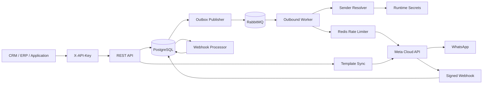

# apiWhatsApp

Enterprise-grade, multi-tenant WhatsApp Business Platform API built for reliable high-volume messaging through Meta Cloud API.

## Current release: 0.5.0

The platform currently provides:

- NestJS + TypeScript REST API
- PostgreSQL + Prisma persistence
- Tenant isolation with scoped API keys
- API key creation, delegation, listing, and revocation
- Append-only tenant administrative audit log
- Contacts and immutable consent history
- Multiple WhatsApp senders per tenant
- Runtime secret references instead of raw Meta tokens in PostgreSQL
- Tenant/WABA message-template synchronization and status tracking
- Local enforcement that outbound templates are synchronized and `APPROVED`
- Durable `message_template_status_update` webhook processing
- Transactional outbox
- RabbitMQ workers with delayed retries and DLQ
- Redis per-phone-number distributed rate limiting
- Text and template outbound messages
- Tenant-scoped idempotency
- Inbound WhatsApp message persistence
- Automatic contact upsert from inbound messages
- 24-hour customer service window enforcement
- Signed Meta webhook verification
- Delivery status processing (`sent`, `delivered`, `read`, `failed`)
- Cursor-paginated message, template, and audit APIs
- OpenAPI / Swagger
- Docker-based local infrastructure
- Versioned database migrations

## Architecture



Outbound HTTP requests do not wait for WhatsApp delivery. The message and queue intent are committed atomically in PostgreSQL and delivered asynchronously.

Inbound and template-status webhook requests are signature-verified and durably persisted before asynchronous processing.

## Requirements

- Node.js 24+
- npm 11+
- Docker and Docker Compose
- Meta application with WhatsApp Business Platform access
- One or more WhatsApp Business phone numbers
- WABA ID configured on each sender that will use templates
- Meta access token for every configured sender
- Meta app secret and webhook verify token

## Local setup

```bash
cp .env.example .env
docker compose up -d
npm install
npm run prisma:generate
npm run prisma:deploy
```

Provision the initial tenant/admin key:

```bash
npm run bootstrap:tenant -- --name="Acme" --slug=acme --key-name=bootstrap
```

The raw API key is printed once. Only an HMAC-SHA256 digest is stored in PostgreSQL.

Start the API:

```bash
npm run start:dev
```

Start the worker in another process:

```bash
npm run start:worker:dev
```

API base URL: `http://localhost:3000/api`

Swagger: `http://localhost:3000/docs`

## Authentication and authorization

Business endpoints require:

```http
X-API-Key: wapi_<prefix>_<secret>
```

Tenant identity is derived exclusively from the API key. Clients cannot provide or override `tenantId`.

Supported scopes:

```text
messages:read
messages:write
contacts:read
contacts:write
phone_numbers:read
phone_numbers:write
templates:read
templates:write
api_keys:read
api_keys:write
audit:read
```

The bootstrap command creates a full administrative key. Use the lifecycle API to create narrower keys for applications and integrations.

## API key lifecycle

```text
POST /api/v1/api-keys
GET  /api/v1/api-keys
POST /api/v1/api-keys/{apiKeyId}/revoke
GET  /api/v1/audit-logs
```

Raw API keys are returned only at creation time. List responses and audit metadata never expose raw secrets or `keyHash` values. A delegated key cannot grant scopes it does not itself hold.

## WhatsApp phone numbers / senders

Store each Meta access token in the runtime environment or deployment secret manager:

```text
META_ACME_WHATSAPP_TOKEN=<meta-access-token>
```

Register the sender using a secret reference:

```http
POST /api/v1/phone-numbers
```

```json
{
  "providerPhoneNumberId": "27681414235104944",
  "wabaId": "8856996819413533",
  "displayPhoneNumber": "16505553333",
  "verifiedName": "Acme Support",
  "credentialRef": "env:META_ACME_WHATSAPP_TOKEN",
  "rateLimitPerSecond": 75,
  "isDefault": true
}
```

The raw Meta token is never persisted in PostgreSQL. A WABA cannot be assigned to multiple tenants through sender configuration.

Sender endpoints:

```text
POST  /api/v1/phone-numbers
GET   /api/v1/phone-numbers
GET   /api/v1/phone-numbers/{senderId}
PATCH /api/v1/phone-numbers/{senderId}
```

## Message template lifecycle

Templates are synchronized at WABA level. The sync endpoint resolves the WABA and its Meta credential from a tenant sender; callers do not submit an access token.

### Synchronize templates

```http
POST /api/v1/templates/sync
X-API-Key: <key-with-templates:write>
Content-Type: application/json
```

Use the active default sender:

```json
{}
```

Or choose a specific tenant sender/WABA:

```json
{
  "senderId": "a5f4b844-1d12-437f-b7e5-702dd592da9d"
}
```

The service reads all pages from Meta before modifying the local catalog. If remote pagination is incomplete or an API request fails, the sync is aborted. After a successful complete sync, local templates missing remotely are marked `DELETED` rather than physically removed.

### List templates

```http
GET /api/v1/templates?status=APPROVED&language=en_US&limit=50
X-API-Key: <key-with-templates:read>
```

Supported filters:

```text
wabaId=<Meta WABA ID>
status=<provider status>
category=<provider category>
language=<language code>
name=<case-insensitive name search>
cursor=<template UUID>
limit=1..100
```

Get one template:

```http
GET /api/v1/templates/{templateId}
```

Template status is stored as a normalized string rather than a database enum so new Meta lifecycle states can be persisted without an emergency schema change.

### Template status webhooks

The durable webhook processor handles Meta `message_template_status_update` events. `entry.id` is treated as the WABA ID and must resolve unambiguously to one configured tenant. Unknown or cross-tenant-ambiguous WABAs fail closed and the raw webhook remains retryable.

Status events update the local template immediately, including rejection reason when supplied. This keeps `APPROVED`, `REJECTED`, `DISABLED`, `DELETED`, and future provider statuses aligned without requiring a manual sync after every lifecycle transition.

### Outbound template enforcement

A new `TEMPLATE` message must satisfy all of the following before an outbox event is created:

1. The contact satisfies the existing template consent policy.
2. The selected sender is active and has a WABA ID.
3. The template `name + language` exists for that tenant/WABA.
4. The local template status is exactly `APPROVED`.

An idempotent retry of an already-created logical message still returns the existing message before re-evaluating current template state.

## Contacts, consent, and service window

```text
POST  /api/v1/contacts
GET   /api/v1/contacts
GET   /api/v1/contacts/{contactId}
PATCH /api/v1/contacts/{contactId}
POST  /api/v1/contacts/{contactId}/consents
GET   /api/v1/contacts/{contactId}/consents
```

Consent events are retained as an immutable history. Template messages require explicit `OPTED_IN` consent.

An inbound user message opens or extends the contact service window to 24 hours after that user message. Free-form `TEXT` messages require an open service window; outside it, use an approved `TEMPLATE` message.

## Messaging API

Send:

```http
POST /api/v1/messages
X-API-Key: <tenant-api-key>
Idempotency-Key: order-48291-confirmation
Content-Type: application/json
```

Free-form example:

```json
{
  "to": "+96170123456",
  "type": "TEXT",
  "payload": {
    "body": "Thanks. We are checking your request now."
  }
}
```

Template example:

```json
{
  "to": "+96170123456",
  "type": "TEMPLATE",
  "senderId": "a5f4b844-1d12-437f-b7e5-702dd592da9d",
  "payload": {
    "name": "order_confirmation",
    "language": "en_US",
    "components": []
  }
}
```

`senderId` is optional. When omitted, the tenant active default sender is used.

List and read:

```text
GET /api/v1/messages
GET /api/v1/messages/{messageId}
```

Outbound lifecycle:

```text
QUEUED -> PROCESSING -> SUBMITTED -> SENT -> DELIVERED -> READ
                              \
                               -> FAILED
```

Inbound messages enter as `RECEIVED`.

## Meta webhook

Configure Meta to use:

```text
GET/POST /api/v1/webhooks/meta/whatsapp
```

POST requests require a valid `X-Hub-Signature-256` generated with `META_APP_SECRET`.

Processing path:

```text
verify signature -> persist raw event -> HTTP 200 -> process asynchronously
```

The processor handles inbound messages, outbound delivery statuses, and message-template status updates before marking the durable webhook event processed.

## Reliability

- Transactional outbox keeps message creation and queue intent atomic.
- RabbitMQ delayed retries default to `5s -> 30s -> 2m -> 10m -> DLQ`.
- Redis rate limits outbound traffic per Meta `phone_number_id`.
- Webhook processing uses leases and exponential retry scheduling.
- Template sync never applies a partial remote catalog.

## Production commands

```bash
npm run prisma:generate
npm run build
npm run prisma:deploy
npm run start:prod
```

Worker:

```bash
npm run start:worker
```

## Important environment variables

```text
DATABASE_URL
REDIS_URL
RABBITMQ_URL
API_KEY_HASH_SECRET
META_GRAPH_API_VERSION
META_APP_SECRET
META_WEBHOOK_VERIFY_TOKEN
META_HTTP_TIMEOUT_MS
OUTBOUND_RETRY_DELAYS_MS
DEFAULT_OUTBOUND_RATE_LIMIT_PER_SECOND
```

Tenant sender tokens are referenced by configured `env:VARIABLE_NAME` values. Never commit production credentials or tokens.

## Next implementation slices

- audit coverage for additional administrative configuration actions
- provider-backed secret stores beyond environment references
- media messages and media storage
- priority queues for OTP / transactional / marketing traffic
- campaign orchestration and segmentation
- agent inbox / conversation assignment
- observability, readiness, tracing, and alerting
- integration and load tests
- dependency lockfile and supply-chain hardening

## Repository workflow

Changes are developed through feature branches and pull requests. Keep implementation, tests, operational documentation, API names, and commit messages in English.
