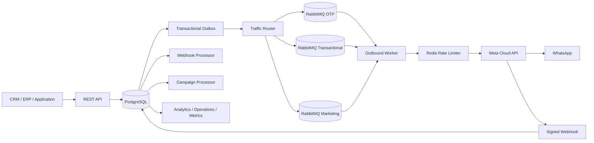

# apiWhatsApp

Enterprise-grade, multi-tenant WhatsApp Business Platform API for reliable high-volume messaging through Meta Cloud API.

## Current release: 0.14.0

Engineering language is English for source code, API contracts, tests, operational documentation, logs, and commit messages.

## Platform capabilities

- NestJS + TypeScript REST API
- PostgreSQL + Prisma persistence and versioned migrations
- Tenant isolation with scoped API keys
- API key lifecycle and append-only audit logs
- Contacts, consent history, normalized tags, and 24-hour service windows
- Reusable tenant contact segments with bounded/indexable predicates
- Multiple WhatsApp senders per tenant with runtime secret references
- WABA template synchronization and lifecycle tracking
- Local `APPROVED` template enforcement before outbound creation
- Server-derived traffic classes: `OTP`, `TRANSACTIONAL`, `MARKETING`
- Isolated RabbitMQ queues, retry queues, DLQs, and traffic-class prefetch
- Priority-aware Redis sender capacity reservation
- Transactional outbox
- Signed Meta webhook ingestion and durable asynchronous processing
- Inbound message persistence and delivery receipt processing
- Durable marketing campaign orchestration with immutable audience snapshots
- Safe per-recipient template personalization
- Live campaign orchestration and WhatsApp delivery analytics
- Process liveness, dependency readiness, and tenant operations diagnostics
- Prometheus-compatible metrics and baseline alert rules
- W3C trace/request correlation across HTTP -> outbox -> RabbitMQ -> worker
- Committed npm lockfile, runtime vulnerability gate, and reproducible Docker build
- Real CI integration test against PostgreSQL, Redis, RabbitMQ, API, worker, and HTTP Meta mock
- Concurrent acceptance/drain load smoke gate
- OpenAPI / Swagger

## Architecture



Outbound HTTP requests accept and persist work quickly. Actual WhatsApp delivery is asynchronous. Message creation and the intent to publish are committed atomically before RabbitMQ publication.

Campaigns reuse the normal message pipeline. They cannot bypass tenant ownership, current consent, template approval, idempotency, priority routing, retries, outbox durability, or sender rate limits.

## Requirements

- Node.js 24+
- npm 11+
- Docker and Docker Compose
- PostgreSQL
- Redis
- RabbitMQ
- Meta application with WhatsApp Business Platform access
- One or more WhatsApp Business phone numbers
- WABA ID for template senders
- Meta access token for each configured sender
- Meta app secret and webhook verify token

## Local setup

```bash
cp .env.example .env
docker compose up -d
npm ci
npm run prisma:generate
npm run prisma:deploy
npm run bootstrap:tenant -- --name="Acme" --slug=acme --key-name=bootstrap
```

The bootstrap command displays a raw API key once. PostgreSQL stores only its HMAC-SHA256 digest.

Run API and worker separately:

```bash
npm run start:dev
npm run start:worker:dev
```

API: `http://localhost:3000/api`

Swagger: `http://localhost:3000/docs`

## Authentication and authorization

Business endpoints use:

```http
X-API-Key: wapi_<prefix>_<secret>
```

Tenant identity comes only from the authenticated key and is never accepted from the request payload.

Current scopes:

```text
messages:read
messages:write
contacts:read
contacts:write
phone_numbers:read
phone_numbers:write
templates:read
templates:write
campaigns:read
campaigns:write
segments:read
segments:write
operations:read
api_keys:read
api_keys:write
audit:read
```

A delegated API key cannot create another key with privileges it does not itself hold.

## Messaging API

```text
POST /api/v1/messages
GET  /api/v1/messages
GET  /api/v1/messages/{messageId}
```

Template messages require explicit `OPTED_IN` consent and an approved synchronized template. Free-form text requires an open customer-service window.

Outbound lifecycle:

```text
QUEUED -> PROCESSING -> SUBMITTED -> SENT -> DELIVERED -> READ
                              \
                               -> FAILED
```

Clients can use `Idempotency-Key` to obtain one logical message across retries.

## Senders and templates

Sender endpoints:

```text
POST  /api/v1/phone-numbers
GET   /api/v1/phone-numbers
GET   /api/v1/phone-numbers/{senderId}
PATCH /api/v1/phone-numbers/{senderId}
```

Sender credentials are stored as runtime references such as:

```text
env:META_ACME_WHATSAPP_TOKEN
```

Raw Meta sender tokens are not stored in PostgreSQL.

Template endpoints:

```text
POST /api/v1/templates/sync
GET  /api/v1/templates
GET  /api/v1/templates/{templateId}
```

Templates are synchronized at WABA level. New template messages require an exact local `name + language + WABA` match with status `APPROVED`.

## Priority routing

Clients cannot choose priority. The server derives traffic class from trusted synchronized metadata.

| Source | Traffic class |
| --- | --- |
| `AUTHENTICATION` template | `OTP` |
| `MARKETING` template | `MARKETING` |
| `UTILITY` / other approved template | `TRANSACTIONAL` |
| Free-form service message | `TRANSACTIONAL` |

Default queues:

```text
whatsapp.outbound.otp
whatsapp.outbound.transactional
whatsapp.outbound.marketing
```

The persisted PostgreSQL traffic class is authoritative. Queue-class mismatches fail closed before Meta delivery.

## Contacts, consent, and segments

Contacts maintain current consent plus an immutable consent-event history. Opt-out blocks new outbound messages. Inbound messages update the customer-service window monotonically.

Saved segments support bounded criteria only:

```text
language
tagsAny
tagsAll
```

They do not accept SQL, JavaScript, JSONPath, or arbitrary expressions.

```text
POST  /api/v1/segments
GET   /api/v1/segments
GET   /api/v1/segments/{segmentId}
GET   /api/v1/segments/{segmentId}/count
PATCH /api/v1/segments/{segmentId}
```

Segment evaluation always adds tenant ownership and current `OPTED_IN` on the server.

## Campaigns

```text
POST /api/v1/campaigns
GET  /api/v1/campaigns
GET  /api/v1/campaigns/{campaignId}
GET  /api/v1/campaigns/{campaignId}/recipients
GET  /api/v1/campaigns/{campaignId}/analytics
POST /api/v1/campaigns/{campaignId}/launch
POST /api/v1/campaigns/{campaignId}/pause
POST /api/v1/campaigns/{campaignId}/resume
POST /api/v1/campaigns/{campaignId}/cancel
```

Campaigns require an approved `MARKETING` template. Audience mode must be exactly one of:

- `allOptedIn=true`;
- non-empty `contactIds`;
- active saved `segmentId`.

Launch runs under a row lock and repeatable-read transaction, selects currently opted-in contacts, and creates an immutable `CampaignRecipient` snapshot. Recipient processing uses leases and `FOR UPDATE SKIP LOCKED`, allowing multiple replicas and crash recovery.

Each recipient has a deterministic logical message key:

```text
campaign:<campaignId>:contact:<contactId>
```

Personalization is opt-in and resolves only allowlisted full-value contact tokens. No code or expression language is evaluated.

## Webhooks

Meta webhook endpoint:

```text
GET/POST /api/v1/webhooks/meta/whatsapp
```

POST requests require a valid `X-Hub-Signature-256` generated with `META_APP_SECRET`.

Processing path:

```text
verify signature -> persist raw event -> HTTP 200 -> process asynchronously
```

The durable processor handles inbound messages, delivery receipts, and template lifecycle updates.

## Health, metrics, and trace correlation

Public probes:

```text
GET /api/health
GET /api/health/live
GET /api/health/ready
```

Readiness checks PostgreSQL, Redis, and RabbitMQ with bounded timeouts.

Tenant operational diagnostics:

```text
GET /api/v1/operations/snapshot
```

Prometheus metrics:

```text
GET /api/metrics
Authorization: Bearer <METRICS_BEARER_TOKEN>
```

Metrics labels are bounded and do not include tenant IDs, phones, message IDs, campaign IDs, payloads, raw dynamic paths, or user-provided strings.

Valid W3C `traceparent` and bounded `x-request-id` values propagate through HTTP, transactional outbox, RabbitMQ retry/DLQ flow, and outbound worker correlation. Span export to an external tracing backend remains a future slice.

See `docs/observability.md` and `ops/prometheus-alerts.yml`.

## Integration and load-smoke gate

Release `0.14.0` adds a real-infrastructure CI gate.

The integration job starts:

```text
PostgreSQL 17
Redis 7
RabbitMQ 4
```

It then executes:

```bash
npm ci
npm run prisma:generate
npm run prisma:deploy
npm run test:integration
```

The test process starts the real Nest API and outbound worker plus a local HTTP Meta-compatible mock. It proves:

```text
HTTP POST /messages
  -> Message + OutboxEvent
  -> RabbitMQ
  -> worker
  -> Redis rate limiter
  -> Meta HTTP mock
  -> provider ID persisted
  -> SUBMITTED
```

It also proves idempotency and trace persistence, then sends a default 50-message concurrent burst and requires:

- zero transport errors;
- HTTP 202 for every accept;
- unique internal IDs;
- p95 acceptance below the conservative CI smoke threshold;
- eventual `SUBMITTED` for every accepted message;
- exact Meta mock delivery count.

This CI burst is a regression test, not a production throughput certification. Dedicated capacity and soak tests are still required for production sizing.

### Meta test seam

The normal Graph host remains:

```text
https://graph.facebook.com
```

`META_GRAPH_API_BASE_URL` exists for controlled testing. HTTP overrides are accepted only under `NODE_ENV=test`; non-test environments require HTTPS. Embedded URL credentials, query strings, and fragments are rejected.

See `docs/testing.md` for local execution, test boundaries, staged capacity profiles, and recommended failure-injection scenarios.

## Supply-chain and Docker policy

The repository commits `package-lock.json` and CI uses deterministic installs.

Development/CI:

```bash
npm ci
```

Production runtime:

```bash
npm ci --omit=dev --omit=peer --omit=optional --ignore-scripts
npm run audit:prod
```

CI blocks high/critical vulnerabilities present in the actual installed production runtime tree. Docker image construction is a required gate after build, runtime-security, and integration.

## CI gates

Every pull request must pass:

1. deterministic `npm ci`;
2. Prisma generation;
3. ESLint;
4. TypeScript/Nest build;
5. unit tests;
6. production-runtime security validation;
7. real PostgreSQL/Redis/RabbitMQ integration and load smoke;
8. production Docker image build.

## Important environment variables

```text
DATABASE_URL
REDIS_URL
RABBITMQ_URL
API_KEY_HASH_SECRET
HEALTH_DEPENDENCY_TIMEOUT_MS
METRICS_BEARER_TOKEN
META_GRAPH_API_VERSION
META_APP_SECRET
META_WEBHOOK_VERIFY_TOKEN
META_HTTP_TIMEOUT_MS
OUTBOUND_RETRY_DELAYS_MS
DEFAULT_OUTBOUND_RATE_LIMIT_PER_SECOND
CAMPAIGN_MAX_RECIPIENTS
```

See `.env.example` for the complete documented configuration set.

Never commit production credentials or access tokens.

## Next implementation slices

- production capacity / soak / failure-injection test expansion
- OpenTelemetry span export and tracing-backend integration
- additional administrative audit coverage
- provider-backed secret stores beyond environment references
- media messages and media storage
- agent inbox and conversation assignment

## Repository workflow

Changes are developed through feature branches and pull requests. `main` is kept behind the complete CI gate chain listed above.
