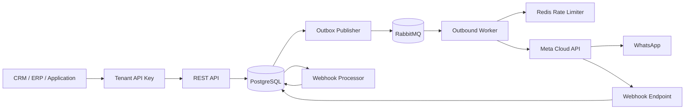

# apiWhatsApp

Enterprise-grade WhatsApp Business Platform API for reliable, high-volume messaging through Meta Cloud API.

## Engineering language

English is the primary language for source code, technical documentation, API contracts, commit messages, logs, and operational tooling.

## Current release scope

The current implementation provides the Core Messaging foundation plus tenant-aware API authentication:

- NestJS + TypeScript REST API
- PostgreSQL persistence with Prisma
- tenant isolation for REST message operations
- hashed tenant API keys with scopes, expiry, and revocation
- transactional outbox between PostgreSQL and RabbitMQ
- PostgreSQL processing leases for horizontal scaling
- dedicated outbound worker process
- Redis-backed distributed outbound rate limiting
- durable RabbitMQ queues, delayed retries, and dead-letter queue
- Meta WhatsApp Cloud API adapter
- text and template outbound messages
- tenant-scoped idempotency
- Meta webhook verification and HMAC-SHA256 signature validation
- durable webhook ingestion
- asynchronous delivery status processing (`sent`, `delivered`, `read`, `failed`)
- message status history
- OpenAPI / Swagger
- Docker-based local infrastructure
- versioned database migrations

## Architecture



The HTTP request path never waits for WhatsApp delivery. A message and its outbox event are committed in one PostgreSQL transaction and delivered asynchronously by the worker.

Tenant identity is derived from the authenticated API key. Clients cannot supply or override `tenantId` in message payloads.

## Requirements

- Node.js 24+
- npm 11+
- Docker and Docker Compose
- a Meta application with WhatsApp Business Platform access
- a WhatsApp Business phone number ID
- a valid Meta access token
- a configured webhook verify token and Meta app secret

## Local setup

### 1. Configure environment

```bash
cp .env.example .env
```

Set the Meta values in `.env`:

```text
META_GRAPH_API_VERSION=vXX.X
META_WHATSAPP_ACCESS_TOKEN=...
META_WHATSAPP_PHONE_NUMBER_ID=...
META_APP_SECRET=...
META_WEBHOOK_VERIFY_TOKEN=...
```

`META_GRAPH_API_VERSION` is intentionally configuration, not a hard-coded value. Set it to a Graph API version currently supported by your Meta application.

### 2. Start infrastructure

```bash
docker compose up -d
```

This starts:

- PostgreSQL on `localhost:5432`
- Redis on `localhost:6379`
- RabbitMQ on `localhost:5672`
- RabbitMQ Management UI on `http://localhost:15672`

Default RabbitMQ local credentials are `guest / guest`.

### 3. Install and prepare the database

```bash
npm install
npm run prisma:generate
npm run prisma:deploy
```

### 4. Bootstrap the first tenant and API key

The REST API is tenant-authenticated. Create the first tenant and credential from the trusted command line after migrations have been applied:

```bash
npm run tenant:bootstrap -- \
  --name "Acme Ltd" \
  --slug acme \
  --key-name "Local development" \
  --scopes messages:read,messages:write
```

Optional expiry can be supplied as an ISO-8601 timestamp:

```text
--expires-at 2027-09-08T00:00:00Z
```

The command creates the tenant and initial API key in one database transaction. The raw credential is printed once in this format:

```text
wapi.<prefix>.<secret>
```

Store it securely. The database stores the lookup prefix and SHA-256 hash only; the raw secret cannot be recovered from the database.

The bootstrap command deliberately fails if the tenant slug already exists. It is intended to create a new tenant, not silently add credentials to an existing one.

### 5. Start the API

```bash
npm run start:dev
```

API base URL:

```text
http://localhost:3000/api
```

Swagger UI:

```text
http://localhost:3000/docs
```

### 6. Start the outbound worker

Run this in a separate terminal/process:

```bash
npm run start:worker:dev
```

The API and worker are deliberately separate processes so they can be scaled independently in production.

## API authentication

Message REST endpoints require an active tenant API key.

Preferred authentication:

```http
Authorization: Bearer wapi.<prefix>.<secret>
```

`X-API-Key` is also accepted for clients that cannot use the Authorization header:

```http
X-API-Key: wapi.<prefix>.<secret>
```

If both headers are supplied they must contain the same credential.

API keys support:

- tenant ownership
- named credentials
- scopes
- optional expiration
- explicit revocation
- periodic `lastUsedAt` tracking

A suspended tenant cannot authenticate even when its API key has not expired or been revoked.

### Current scopes

| Scope | Permission |
| --- | --- |
| `messages:write` | Create outbound WhatsApp messages |
| `messages:read` | Read tenant-owned messages and status history |
| `*` | Wildcard access to all currently required scopes |

The Meta webhook and health endpoint do not use tenant API keys. The webhook is protected independently by Meta verification and HMAC-SHA256 signature validation.

## REST API

### Health

```http
GET /api/health
```

### Create outbound message

```http
POST /api/v1/messages
Authorization: Bearer wapi.<prefix>.<secret>
Idempotency-Key: order-48291-confirmation
Content-Type: application/json
```

Text example:

```json
{
  "to": "+96170123456",
  "type": "TEXT",
  "payload": {
    "body": "Your order has been confirmed."
  }
}
```

Accepted response:

```json
{
  "messageId": "c7d63dd8-8ea0-4ed0-bfab-0de35eb40409",
  "status": "QUEUED",
  "createdAt": "2026-09-08T19:00:00.000Z"
}
```

Template example:

```http
POST /api/v1/messages
Authorization: Bearer wapi.<prefix>.<secret>
Idempotency-Key: order-48291-template
Content-Type: application/json
```

```json
{
  "to": "+96170123456",
  "type": "TEMPLATE",
  "payload": {
    "name": "order_confirmation",
    "language": "en_US",
    "components": [
      {
        "type": "body",
        "parameters": [
          { "type": "text", "text": "48291" }
        ]
      }
    ]
  }
}
```

The legacy body field `idempotencyKey` remains temporarily accepted, but new integrations should use the `Idempotency-Key` HTTP header. If both are sent they must match.

### Get message status and history

```http
GET /api/v1/messages/{messageId}
Authorization: Bearer wapi.<prefix>.<secret>
```

A tenant can only retrieve its own messages. A valid message UUID owned by a different tenant is treated as not found.

Internal lifecycle:

```text
QUEUED -> PROCESSING -> SUBMITTED -> SENT -> DELIVERED -> READ
                              \
                               -> FAILED
```

Retryable provider or infrastructure failures move the message back to `QUEUED`. Permanent failures and exhausted retry policies move it to `FAILED` and the queue message is copied to the dead-letter queue.

## Tenant isolation and idempotency

`tenantId` is derived from the authenticated API key and persisted with every REST-created message.

Idempotency is scoped by:

```text
tenantId + idempotencyKey
```

This means two different tenants may legitimately use the same idempotency key without colliding. Repeated calls from the same tenant with the same key return the existing logical message.

Legacy messages created before tenant authentication may have a null `tenantId`. Those records are not reachable through tenant-scoped REST lookups and can be migrated/backfilled separately before making the database column mandatory.

## Meta webhook

Configure Meta to use:

```text
GET/POST /api/v1/webhooks/meta/whatsapp
```

The GET endpoint handles Meta webhook verification. POST requests must contain a valid `X-Hub-Signature-256` generated with the configured Meta app secret.

Webhook requests follow this path:

```text
verify signature -> persist raw event -> return HTTP 200 -> process asynchronously
```

Delivery receipts update local messages using Meta's provider message ID. Status updates are monotonic so delayed webhook events cannot normally downgrade a message from `READ` to `SENT`, for example.

## Reliability model

### Transactional outbox

Message creation and queue intent are committed in the same PostgreSQL transaction. The outbox publisher retries RabbitMQ publication independently if the broker is temporarily unavailable.

### Horizontal processing leases

Outbox and webhook database pollers use PostgreSQL row claiming with `FOR UPDATE SKIP LOCKED` and processing leases. Multiple API instances can therefore poll safely without intentionally processing the same pending database row at the same time.

Outbound messages also use an atomic processing lease before a worker calls Meta. Duplicate RabbitMQ deliveries with an active lease do not execute simultaneous Meta send requests.

The system provides strong duplicate protection inside the platform, but no external HTTP integration can guarantee perfect exactly-once delivery if Meta accepts a request and the worker crashes before persisting the provider message ID. Reconciliation and provider-status recovery are planned hardening areas.

### RabbitMQ retry policy

Default retry delays:

```text
5 seconds -> 30 seconds -> 2 minutes -> 10 minutes -> DLQ
```

Configure them with:

```text
OUTBOUND_RETRY_DELAYS_MS=5000,30000,120000,600000
```

### Distributed rate limiting

Workers share a Redis-backed per-phone-number rate limit. The default is intentionally below common Meta throughput ceilings:

```text
DEFAULT_OUTBOUND_RATE_LIMIT_PER_SECOND=75
```

This value is operational configuration and must be aligned with the real throughput available to the connected WhatsApp number.

## Main environment variables

| Variable | Purpose |
| --- | --- |
| `DATABASE_URL` | PostgreSQL connection string |
| `REDIS_URL` | Redis connection string |
| `RABBITMQ_URL` | RabbitMQ connection string |
| `META_GRAPH_API_VERSION` | Explicit Meta Graph API version |
| `META_WHATSAPP_ACCESS_TOKEN` | Server-side Meta access token |
| `META_WHATSAPP_PHONE_NUMBER_ID` | WhatsApp Business phone number ID |
| `META_APP_SECRET` | Used to validate webhook signatures |
| `META_WEBHOOK_VERIFY_TOKEN` | Meta webhook verification token |
| `META_HTTP_TIMEOUT_MS` | Meta HTTP request timeout |
| `OUTBOUND_WORKER_PREFETCH` | RabbitMQ worker prefetch |
| `OUTBOUND_RETRY_DELAYS_MS` | Delayed retry policy |
| `OUTBOUND_MESSAGE_LEASE_MS` | Worker ownership lease for a message |
| `DEFAULT_OUTBOUND_RATE_LIMIT_PER_SECOND` | Distributed outbound rate limit |
| `OUTBOX_POLL_INTERVAL_MS` | Transactional outbox polling interval |
| `OUTBOX_LEASE_MS` | Outbox row processing lease |
| `WEBHOOK_PROCESSOR_INTERVAL_MS` | Pending webhook polling interval |
| `WEBHOOK_PROCESSOR_LEASE_MS` | Webhook row processing lease |

Never commit production credentials or tokens to this repository.

## Production processes

Generate the Prisma client and build once:

```bash
npm run prisma:generate
npm run build
```

Run database migrations before starting a new application version:

```bash
npm run prisma:deploy
```

Run the HTTP API:

```bash
npm run start:prod
```

Run one or more outbound workers:

```bash
npm run start:worker
```

Tenant/API key bootstrap is an administrative operation and should be executed only from a trusted environment with database access.

## Current limitations / next slices

The platform intentionally does not yet include every planned capability. Upcoming slices include:

- API key lifecycle administration and rotation tooling
- inbound WhatsApp message persistence
- contacts and consent / opt-out enforcement
- media messages and media storage
- template synchronization and lifecycle management
- priority queues for OTP / transactional / marketing traffic
- campaign orchestration and segmentation
- metrics, tracing, readiness checks, and alerting
- integration and load testing
- provider reconciliation for ambiguous send outcomes

## Repository workflow

Changes should be developed through feature branches and pull requests. Keep implementation, tests, operational documentation, API names, and commit messages in English.
