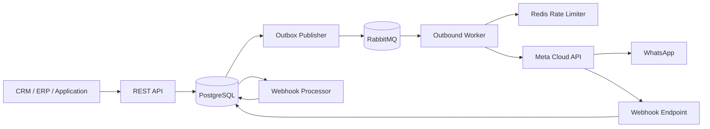

# apiWhatsApp

Enterprise-grade WhatsApp Business Platform API for reliable, high-volume messaging through Meta Cloud API.

## Engineering language

English is the primary language for source code, technical documentation, API contracts, commit messages, logs, and operational tooling.

## Current release scope

The current implementation provides the Core Messaging foundation:

- NestJS + TypeScript API
- PostgreSQL persistence with Prisma
- Transactional outbox between PostgreSQL and RabbitMQ
- Dedicated outbound worker process
- Redis-backed distributed outbound rate limiting
- Durable RabbitMQ queues, delayed retries, and dead-letter queue
- Meta WhatsApp Cloud API adapter
- Text and template outbound messages
- API idempotency
- Meta webhook verification and HMAC-SHA256 signature validation
- Durable webhook ingestion
- Asynchronous delivery status processing (`sent`, `delivered`, `read`, `failed`)
- Message status history
- OpenAPI / Swagger
- Docker-based local infrastructure
- Initial database migration

## Architecture



The HTTP request path never waits for WhatsApp delivery. A message is persisted together with an outbox event in one database transaction and is delivered asynchronously by the worker.

## Requirements

- Node.js 24+
- npm 11+
- Docker and Docker Compose
- A Meta application with WhatsApp Business Platform access
- A WhatsApp Business phone number ID
- A valid Meta access token
- A configured webhook verify token and Meta app secret

## Local setup

### 1. Configure environment

```bash
cp .env.example .env
```

Set the Meta values in `.env`:

```text
META_GRAPH_API_VERSION=vXX.X
META_WHATSAPP_ACCESS_TOKEN=...
META_WHATSAPP_PHONE_NUMBER_ID=...
META_APP_SECRET=...
META_WEBHOOK_VERIFY_TOKEN=...
```

`META_GRAPH_API_VERSION` is intentionally configuration, not a hard-coded value. Set it to a Graph API version currently supported by your Meta application.

### 2. Start infrastructure

```bash
docker compose up -d
```

This starts:

- PostgreSQL on `localhost:5432`
- Redis on `localhost:6379`
- RabbitMQ on `localhost:5672`
- RabbitMQ Management UI on `http://localhost:15672`

Default RabbitMQ local credentials are `guest / guest`.

### 3. Install and prepare the database

```bash
npm install
npm run prisma:generate
npm run prisma:deploy
```

### 4. Start the API

```bash
npm run start:dev
```

API base URL:

```text
http://localhost:3000/api
```

Swagger UI:

```text
http://localhost:3000/docs
```

### 5. Start the outbound worker

Run this in a separate terminal/process:

```bash
npm run start:worker:dev
```

The API and worker are deliberately separate processes so they can be scaled independently in production.

## REST API

### Health

```http
GET /api/health
```

### Create outbound message

```http
POST /api/v1/messages
Content-Type: application/json
```

Text example:

```json
{
  "to": "+96170123456",
  "type": "TEXT",
  "payload": {
    "body": "Your order has been confirmed."
  },
  "idempotencyKey": "order-48291-confirmation"
}
```

Accepted response:

```json
{
  "messageId": "c7d63dd8-8ea0-4ed0-bfab-0de35eb40409",
  "status": "QUEUED",
  "createdAt": "2026-09-08T19:00:00.000Z"
}
```

Template example:

```json
{
  "to": "+96170123456",
  "type": "TEMPLATE",
  "payload": {
    "name": "order_confirmation",
    "language": "en_US",
    "components": [
      {
        "type": "body",
        "parameters": [
          { "type": "text", "text": "48291" }
        ]
      }
    ]
  },
  "idempotencyKey": "order-48291-template"
}
```

### Get message status and history

```http
GET /api/v1/messages/{messageId}
```

Internal lifecycle:

```text
QUEUED -> PROCESSING -> SUBMITTED -> SENT -> DELIVERED -> READ
                              \
                               -> FAILED
```

Retryable provider or infrastructure failures move the message back to `QUEUED`. Permanent failures and exhausted retry policies move it to `FAILED` and the queue message is copied to the dead-letter queue.

## Meta webhook

Configure Meta to use:

```text
GET/POST /api/v1/webhooks/meta/whatsapp
```

The GET endpoint handles Meta webhook verification. POST requests must contain a valid `X-Hub-Signature-256` generated with the configured Meta app secret.

Webhook requests follow this path:

```text
verify signature -> persist raw event -> return HTTP 200 -> process asynchronously
```

Delivery receipts update local messages using Meta's provider message ID. Status updates are monotonic so delayed webhook events cannot normally downgrade a message from `READ` to `SENT`, for example.

## Reliability model

### Transactional outbox

Message creation and queue intent are committed in the same PostgreSQL transaction. The outbox publisher retries RabbitMQ publication independently if the broker is temporarily unavailable.

### RabbitMQ retry policy

Default retry delays:

```text
5 seconds -> 30 seconds -> 2 minutes -> 10 minutes -> DLQ
```

Configure them with:

```text
OUTBOUND_RETRY_DELAYS_MS=5000,30000,120000,600000
```

### Distributed rate limiting

Workers share a Redis-backed per-phone-number rate limit. The default is intentionally below common Meta throughput ceilings:

```text
DEFAULT_OUTBOUND_RATE_LIMIT_PER_SECOND=75
```

This value is operational configuration and must be aligned with the real throughput available to the connected WhatsApp number.

### Idempotency

Clients should provide a stable `idempotencyKey` for every logical outbound message. Repeated API calls with the same key return the existing message rather than creating another one.

## Main environment variables

| Variable | Purpose |
| --- | --- |
| `DATABASE_URL` | PostgreSQL connection string |
| `REDIS_URL` | Redis connection string |
| `RABBITMQ_URL` | RabbitMQ connection string |
| `META_GRAPH_API_VERSION` | Explicit Meta Graph API version |
| `META_WHATSAPP_ACCESS_TOKEN` | Server-side Meta access token |
| `META_WHATSAPP_PHONE_NUMBER_ID` | WhatsApp Business phone number ID |
| `META_APP_SECRET` | Used to validate webhook signatures |
| `META_WEBHOOK_VERIFY_TOKEN` | Meta webhook verification token |
| `META_HTTP_TIMEOUT_MS` | Meta HTTP request timeout |
| `OUTBOUND_WORKER_PREFETCH` | RabbitMQ worker prefetch |
| `OUTBOUND_RETRY_DELAYS_MS` | Delayed retry policy |
| `DEFAULT_OUTBOUND_RATE_LIMIT_PER_SECOND` | Distributed outbound rate limit |
| `OUTBOX_POLL_INTERVAL_MS` | Transactional outbox polling interval |
| `WEBHOOK_PROCESSOR_INTERVAL_MS` | Pending webhook polling interval |

Never commit production credentials or tokens to this repository.

## Production processes

Build once:

```bash
npm run prisma:generate
npm run build
```

Run the HTTP API:

```bash
npm run start:prod
```

Run one or more outbound workers:

```bash
npm run start:worker
```

A production deployment should run database migrations before starting the new application version:

```bash
npm run prisma:deploy
```

## Current limitations / next slices

The foundation intentionally does not yet include every platform feature. Planned next slices include:

- API authentication and tenant isolation
- inbound WhatsApp message persistence
- contacts and consent / opt-out enforcement
- media messages and media storage
- template synchronization and lifecycle management
- priority queues for OTP / transactional / marketing traffic
- campaign orchestration and segmentation
- stronger distributed claims for multi-instance outbox/webhook processors
- metrics, tracing, readiness checks, and alerting
- automated unit, integration, and load tests

## Repository workflow

Changes should be developed through feature branches and pull requests. Keep implementation, tests, operational documentation, API names, and commit messages in English.
