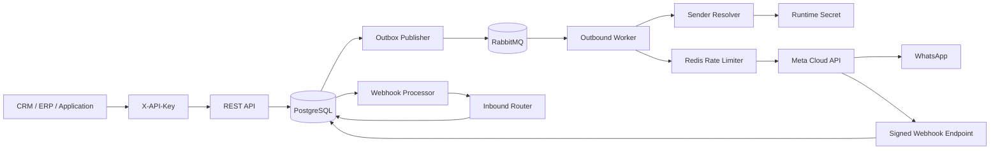

# apiWhatsApp

Enterprise-grade WhatsApp Business Platform API for reliable, high-volume, multi-tenant messaging through Meta Cloud API.

## Engineering language

English is the primary language for source code, technical documentation, API contracts, commit messages, logs, and operational tooling.

## Current release: 0.3.0

The current implementation provides:

- NestJS + TypeScript REST API
- PostgreSQL persistence with Prisma
- Tenant isolation with scoped API keys
- Contacts and immutable consent history
- Multiple WhatsApp senders per tenant
- Secret-reference based Meta credentials; raw sender tokens are not stored in PostgreSQL
- Transactional outbox between PostgreSQL and RabbitMQ
- Dedicated outbound worker process
- Redis-backed per-phone-number distributed rate limiting
- Durable RabbitMQ queues, delayed retries, and dead-letter queue
- Text and template outbound messages
- Tenant-scoped idempotency
- Inbound WhatsApp message persistence
- Automatic contact upsert from inbound messages
- 24-hour customer service window tracking
- Meta webhook verification and HMAC-SHA256 signature validation
- Asynchronous delivery status processing (`sent`, `delivered`, `read`, `failed`)
- Cursor-paginated tenant message listing
- OpenAPI / Swagger
- Docker-based local infrastructure
- Versioned database migrations

## Architecture



The HTTP request path never waits for WhatsApp delivery. Outbound messages are persisted together with an outbox event in one database transaction and are delivered asynchronously by the worker.

Inbound webhook requests are signature-verified and persisted before asynchronous processing. `metadata.phone_number_id` resolves the configured sender and therefore the owning tenant.

## Requirements

- Node.js 24+
- npm 11+
- Docker and Docker Compose
- A Meta application with WhatsApp Business Platform access
- At least one WhatsApp Business phone number
- A Meta access token for every configured sender
- A configured webhook verify token and Meta app secret

## Local setup

### 1. Configure environment

```bash
cp .env.example .env
```

Set at least:

```text
API_KEY_HASH_SECRET=replace-with-at-least-32-random-bytes
META_GRAPH_API_VERSION=vXX.X
META_APP_SECRET=...
META_WEBHOOK_VERIFY_TOKEN=...
```

`META_GRAPH_API_VERSION` is intentionally configuration rather than a hard-coded value. Set it to a Graph API version supported by your Meta application.

### 2. Start infrastructure

```bash
docker compose up -d
```

This starts PostgreSQL, Redis, RabbitMQ, and the RabbitMQ Management UI.

### 3. Install and prepare the database

```bash
npm install
npm run prisma:generate
npm run prisma:deploy
```

### 4. Provision a tenant and API key

```bash
npm run bootstrap:tenant -- --name="Acme" --slug=acme --key-name=local
```

The command creates or reuses the tenant and prints a new API key once. Store the raw key securely; only an HMAC-SHA256 digest is persisted in PostgreSQL.

### 5. Configure a tenant sender secret

Store the Meta token in the runtime environment or your deployment secret manager. For local development:

```text
META_ACME_WHATSAPP_TOKEN=<meta-access-token>
```

Then register the phone number through the API using the reference `env:META_ACME_WHATSAPP_TOKEN` rather than sending the raw token to the database.

### 6. Start API and worker

API:

```bash
npm run start:dev
```

Worker in a separate process:

```bash
npm run start:worker:dev
```

API base URL:

```text
http://localhost:3000/api
```

Swagger UI:

```text
http://localhost:3000/docs
```

## Authentication and tenant isolation

All business API endpoints require:

```http
X-API-Key: wapi_<prefix>_<secret>
```

Tenant identity comes exclusively from the authenticated API key. Clients cannot supply or override `tenantId` in business payloads.

The only public HTTP surfaces are the health endpoint and Meta webhook endpoint. Meta webhook POST requests still require a valid `X-Hub-Signature-256`.

Supported scopes:

- `messages:read`
- `messages:write`
- `contacts:read`
- `contacts:write`
- `phone_numbers:read`
- `phone_numbers:write`

## WhatsApp phone numbers / senders

Each tenant can register multiple Meta WhatsApp phone numbers. One active sender is maintained as the tenant default.

### Register a sender

```http
POST /api/v1/phone-numbers
X-API-Key: <tenant-api-key>
Content-Type: application/json
```

```json
{
  "providerPhoneNumberId": "27681414235104944",
  "wabaId": "8856996819413533",
  "displayPhoneNumber": "16505553333",
  "verifiedName": "Acme Support",
  "credentialRef": "env:META_ACME_WHATSAPP_TOKEN",
  "rateLimitPerSecond": 75,
  "isDefault": true
}
```

The raw Meta access token is not part of this payload and is never persisted in PostgreSQL. The worker resolves `credentialRef` at runtime.

Current credential reference provider:

```text
env:VARIABLE_NAME
```

The abstraction is intentionally separated so a cloud secret-manager provider can be added later without changing message records.

### Manage senders

```http
GET /api/v1/phone-numbers
GET /api/v1/phone-numbers/{senderId}
PATCH /api/v1/phone-numbers/{senderId}
```

If the active default sender is disabled, the service promotes another active sender automatically when one exists.

## Contacts and consent

### Create a contact

```http
POST /api/v1/contacts
X-API-Key: <tenant-api-key>
Content-Type: application/json
```

```json
{
  "phone": "+96170123456",
  "name": "Jane Doe",
  "language": "en",
  "timezone": "Asia/Beirut",
  "metadata": {
    "crmId": "C-10042"
  }
}
```

### List and update contacts

```http
GET /api/v1/contacts
GET /api/v1/contacts/{contactId}
PATCH /api/v1/contacts/{contactId}
```

All contact lookups are tenant-scoped.

### Record business-initiated consent

```http
POST /api/v1/contacts/{contactId}/consents
X-API-Key: <tenant-api-key>
Content-Type: application/json
```

```json
{
  "status": "OPTED_IN",
  "source": "website_checkout",
  "evidence": {
    "formVersion": "2026-09"
  }
}
```

Opt-out example:

```json
{
  "status": "OPTED_OUT",
  "source": "customer_request"
}
```

Consent changes update the current contact snapshot and append an immutable audit event. Historical imports are accepted without allowing an older event to overwrite a newer decision.

History:

```http
GET /api/v1/contacts/{contactId}/consents
```

Template messages require explicit `OPTED_IN` consent.

## 24-hour customer service window

An inbound user message opens or extends the contact's customer service window to 24 hours after that user message.

The platform stores:

```text
lastInboundAt
serviceWindowExpiresAt
```

Free-form `TEXT` messages are accepted only while this service window is open. Outside the window, use an approved `TEMPLATE` message and satisfy the contact opt-in policy.

The inbound timestamp is taken from Meta's webhook when valid. Delayed or duplicated webhook delivery cannot shorten a window opened by a newer user message.

## REST messaging API

### Health

```http
GET /api/health
```

### Create outbound message

```http
POST /api/v1/messages
X-API-Key: <tenant-api-key>
Idempotency-Key: order-48291-confirmation
Content-Type: application/json
```

If `senderId` is omitted, the tenant's active default sender is selected.

Free-form service reply example:

```json
{
  "to": "+96170123456",
  "type": "TEXT",
  "senderId": "a5f4b844-1d12-437f-b7e5-702dd592da9d",
  "payload": {
    "body": "Thanks. We are checking your request now."
  }
}
```

Template example:

```json
{
  "to": "+96170123456",
  "type": "TEMPLATE",
  "payload": {
    "name": "order_confirmation",
    "language": "en_US",
    "components": [
      {
        "type": "body",
        "parameters": [
          { "type": "text", "text": "48291" }
        ]
      }
    ]
  }
}
```

Accepted response:

```json
{
  "messageId": "c7d63dd8-8ea0-4ed0-bfab-0de35eb40409",
  "status": "QUEUED",
  "createdAt": "2026-09-08T19:00:00.000Z"
}
```

### List messages

```http
GET /api/v1/messages?direction=INBOUND&limit=50
X-API-Key: <tenant-api-key>
```

Supported filters:

```text
direction=INBOUND|OUTBOUND
status=<MessageStatus>
phone=<E.164 phone>
senderId=<internal sender UUID>
cursor=<message UUID>
limit=1..100
```

Response:

```json
{
  "items": [],
  "nextCursor": null
}
```

The cursor itself must belong to the authenticated tenant.

### Get message and status history

```http
GET /api/v1/messages/{messageId}
X-API-Key: <tenant-api-key>
```

Messages cannot be retrieved across tenants.

Outbound lifecycle:

```text
QUEUED -> PROCESSING -> SUBMITTED -> SENT -> DELIVERED -> READ
                              \
                               -> FAILED
```

Inbound messages enter as:

```text
RECEIVED
```

## Inbound messages

Meta sends inbound WhatsApp events to:

```text
POST /api/v1/webhooks/meta/whatsapp
```

After signature verification and durable raw-event persistence, the asynchronous processor:

1. Reads `metadata.phone_number_id`.
2. Resolves the configured sender and tenant.
3. Deduplicates by Meta provider message ID.
4. Creates or updates the tenant contact.
5. Opens/extends the 24-hour customer service window.
6. Persists an inbound `Message` with status `RECEIVED`.
7. Processes delivery-status events in the same raw webhook payload when present.

Unknown Meta `phone_number_id` values do not get silently assigned to a tenant; processing fails closed and the raw webhook remains available for retry/diagnosis.

## Idempotency

Clients should provide a stable `Idempotency-Key` header for every logical outbound message. Idempotency is scoped by tenant, so separate customers can safely use the same external key without colliding.

The legacy body `idempotencyKey` remains temporarily supported; the HTTP header is preferred.

An idempotent retry returns the already-created logical message before re-evaluating current service-window state.

## Meta webhook security

Configure Meta to use:

```text
GET/POST /api/v1/webhooks/meta/whatsapp
```

The GET endpoint handles Meta webhook verification. POST requests must contain a valid `X-Hub-Signature-256` generated with the configured Meta app secret.

Processing path:

```text
verify signature -> persist raw event -> return HTTP 200 -> process asynchronously
```

Delivery receipts update local messages using Meta's provider message ID. Status updates are monotonic so a delayed `sent` event cannot normally downgrade a message already marked `read`.

## Reliability model

### Transactional outbox

Message creation and queue intent are committed in the same PostgreSQL transaction. The outbox publisher retries RabbitMQ publication independently if the broker is temporarily unavailable.

### RabbitMQ retry policy

Default outbound retry delays:

```text
5 seconds -> 30 seconds -> 2 minutes -> 10 minutes -> DLQ
```

Configure with:

```text
OUTBOUND_RETRY_DELAYS_MS=5000,30000,120000,600000
```

### Per-phone-number distributed rate limiting

Workers share Redis counters keyed by Meta `phone_number_id`. Each configured sender may override the platform default:

```json
{
  "rateLimitPerSecond": 75
}
```

Fallback configuration:

```text
DEFAULT_OUTBOUND_RATE_LIMIT_PER_SECOND=75
```

The configured value must be aligned with the real throughput available to the specific WhatsApp number.

## Main environment variables

| Variable | Purpose |
| --- | --- |
| `DATABASE_URL` | PostgreSQL connection string |
| `REDIS_URL` | Redis connection string |
| `RABBITMQ_URL` | RabbitMQ connection string |
| `API_KEY_HASH_SECRET` | Server-side HMAC secret used to hash tenant API keys |
| `META_GRAPH_API_VERSION` | Explicit Meta Graph API version |
| `META_APP_SECRET` | Used to validate Meta webhook signatures |
| `META_WEBHOOK_VERIFY_TOKEN` | Meta webhook verification token |
| `META_HTTP_TIMEOUT_MS` | Meta HTTP request timeout |
| `META_<TENANT>_WHATSAPP_TOKEN` | Example runtime secret referenced by a tenant sender |
| `META_WHATSAPP_ACCESS_TOKEN` | Legacy fallback token for messages without `senderId` |
| `META_WHATSAPP_PHONE_NUMBER_ID` | Legacy fallback phone ID for messages without `senderId` |
| `OUTBOUND_WORKER_PREFETCH` | RabbitMQ worker prefetch |
| `OUTBOUND_RETRY_DELAYS_MS` | Delayed retry policy |
| `DEFAULT_OUTBOUND_RATE_LIMIT_PER_SECOND` | Default per-sender distributed rate limit |
| `OUTBOX_POLL_INTERVAL_MS` | Transactional outbox polling interval |
| `WEBHOOK_PROCESSOR_INTERVAL_MS` | Pending webhook polling interval |

Never commit production credentials or tokens to this repository.

## Production processes

Generate client and build:

```bash
npm run prisma:generate
npm run build
```

Apply database migrations before starting a new release:

```bash
npm run prisma:deploy
```

Run HTTP API:

```bash
npm run start:prod
```

Run one or more outbound workers:

```bash
npm run start:worker
```

## Current limitations / next slices

Planned next implementation slices include:

- API-key lifecycle management endpoints and audit logging
- provider-backed secret stores beyond environment references
- media messages and media storage
- template synchronization and lifecycle management
- priority queues for OTP / transactional / marketing traffic
- campaign orchestration and segmentation
- agent inbox / conversation assignment
- metrics, tracing, readiness checks, and alerting
- integration and load tests
- dependency lockfile and supply-chain hardening

## Repository workflow

Changes are developed through feature branches and pull requests. Keep implementation, tests, operational documentation, API names, and commit messages in English.
