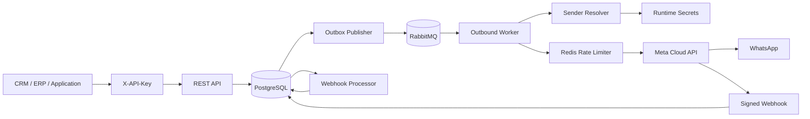

# apiWhatsApp

Enterprise-grade, multi-tenant WhatsApp Business Platform API built for reliable high-volume messaging through Meta Cloud API.

## Engineering language

English is the primary language for source code, technical documentation, API contracts, commit messages, logs, and operational tooling.

## Current release: 0.4.0

The platform currently provides:

- NestJS + TypeScript REST API
- PostgreSQL + Prisma persistence
- Tenant isolation with scoped API keys
- API key creation, delegation, listing, and revocation
- Append-only tenant administrative audit log
- Contacts and immutable consent history
- Multiple WhatsApp senders per tenant
- Runtime secret references instead of raw Meta tokens in PostgreSQL
- Transactional outbox
- RabbitMQ workers with delayed retries and DLQ
- Redis per-phone-number distributed rate limiting
- Text and template outbound messages
- Tenant-scoped idempotency
- Inbound WhatsApp message persistence
- Automatic contact upsert from inbound messages
- 24-hour customer service window enforcement
- Signed Meta webhook verification
- Delivery status processing (`sent`, `delivered`, `read`, `failed`)
- Cursor-paginated message and audit APIs
- OpenAPI / Swagger
- Docker-based local infrastructure
- Versioned database migrations

## Architecture



Outbound HTTP requests do not wait for WhatsApp delivery. The message and queue intent are committed atomically in PostgreSQL and delivered asynchronously.

Inbound webhook requests are signature-verified and persisted before asynchronous processing. `metadata.phone_number_id` resolves the configured sender and owning tenant.

## Requirements

- Node.js 24+
- npm 11+
- Docker and Docker Compose
- Meta application with WhatsApp Business Platform access
- One or more WhatsApp Business phone numbers
- Meta access token for every configured sender
- Meta app secret and webhook verify token

## Local setup

```bash
cp .env.example .env
docker compose up -d
npm install
npm run prisma:generate
npm run prisma:deploy
```

Provision the initial tenant/admin key:

```bash
npm run bootstrap:tenant -- --name="Acme" --slug=acme --key-name=bootstrap
```

The raw API key is printed once. Only an HMAC-SHA256 digest is stored in PostgreSQL.

Start the API:

```bash
npm run start:dev
```

Start the worker in another process:

```bash
npm run start:worker:dev
```

API base URL:

```text
http://localhost:3000/api
```

Swagger:

```text
http://localhost:3000/docs
```

## Authentication and authorization

Business endpoints require:

```http
X-API-Key: wapi_<prefix>_<secret>
```

Tenant identity is derived exclusively from the API key. Clients cannot provide or override `tenantId`.

Supported scopes:

```text
messages:read
messages:write
contacts:read
contacts:write
phone_numbers:read
phone_numbers:write
api_keys:read
api_keys:write
audit:read
```

The bootstrap command creates a full administrative key. Use the lifecycle API to create narrower keys for applications and integrations.

## API key lifecycle

### Create a delegated key

```http
POST /api/v1/api-keys
X-API-Key: <admin-api-key>
Content-Type: application/json
```

```json
{
  "name": "crm-production",
  "scopes": ["messages:read", "messages:write", "contacts:read"]
}
```

The response includes the raw API key once:

```json
{
  "apiKey": "wapi_<prefix>_<secret>",
  "key": {
    "id": "...",
    "name": "crm-production",
    "prefix": "...",
    "scopes": ["messages:read", "messages:write", "contacts:read"],
    "active": true
  }
}
```

A key cannot grant a scope that it does not itself hold. This prevents delegated credentials from escalating privileges.

### List keys

```http
GET /api/v1/api-keys
```

The listing never returns raw secrets or `keyHash` values.

### Revoke a key

```http
POST /api/v1/api-keys/{apiKeyId}/revoke
```

Revocation is idempotent. Creating and revoking keys writes an audit record in the same PostgreSQL transaction as the credential change.

## Audit log

Administrative audit events are append-only from the public API.

```http
GET /api/v1/audit-logs?limit=50
X-API-Key: <key-with-audit:read>
```

Supported filters:

```text
action=<exact action>
entityType=<entity type>
entityId=<entity id>
cursor=<audit UUID>
limit=1..100
```

Current key lifecycle actions include:

```text
api_key.created
api_key.revoked
```

Audit records contain tenant, actor key ID, action, entity reference, safe metadata, source IP when available, user agent, and timestamp. Raw API keys and API-key hashes are not written to audit metadata.

## WhatsApp phone numbers / senders

Store the Meta access token in the runtime environment or deployment secret manager:

```text
META_ACME_WHATSAPP_TOKEN=<meta-access-token>
```

Register the sender using a secret reference:

```http
POST /api/v1/phone-numbers
```

```json
{
  "providerPhoneNumberId": "27681414235104944",
  "wabaId": "8856996819413533",
  "displayPhoneNumber": "16505553333",
  "verifiedName": "Acme Support",
  "credentialRef": "env:META_ACME_WHATSAPP_TOKEN",
  "rateLimitPerSecond": 75,
  "isDefault": true
}
```

The raw Meta token is never persisted in PostgreSQL.

Sender endpoints:

```text
POST  /api/v1/phone-numbers
GET   /api/v1/phone-numbers
GET   /api/v1/phone-numbers/{senderId}
PATCH /api/v1/phone-numbers/{senderId}
```

If the active default sender is disabled, another active sender is promoted automatically when available.

## Contacts and consent

```text
POST  /api/v1/contacts
GET   /api/v1/contacts
GET   /api/v1/contacts/{contactId}
PATCH /api/v1/contacts/{contactId}
POST  /api/v1/contacts/{contactId}/consents
GET   /api/v1/contacts/{contactId}/consents
```

Consent events are retained as an immutable history. An older imported event cannot overwrite a newer current decision.

Template messages require explicit `OPTED_IN` consent.

## 24-hour customer service window

An inbound user message opens or extends the contact's service window to 24 hours after that user message.

The contact stores:

```text
lastInboundAt
serviceWindowExpiresAt
```

Free-form `TEXT` messages require an open service window. Outside the window, use an approved `TEMPLATE` message and satisfy the template opt-in policy.

Delayed or duplicate webhooks cannot shorten a window opened by a newer inbound user message.

## Messaging API

### Send

```http
POST /api/v1/messages
X-API-Key: <tenant-api-key>
Idempotency-Key: order-48291-confirmation
Content-Type: application/json
```

Free-form example:

```json
{
  "to": "+96170123456",
  "type": "TEXT",
  "payload": {
    "body": "Thanks. We are checking your request now."
  }
}
```

Template example:

```json
{
  "to": "+96170123456",
  "type": "TEMPLATE",
  "payload": {
    "name": "order_confirmation",
    "language": "en_US",
    "components": []
  }
}
```

`senderId` is optional. When omitted, the tenant's active default sender is used.

### List

```http
GET /api/v1/messages?direction=INBOUND&limit=50
```

Filters:

```text
direction=INBOUND|OUTBOUND
status=<MessageStatus>
phone=<E.164 phone>
senderId=<sender UUID>
cursor=<message UUID>
limit=1..100
```

### Get message and history

```http
GET /api/v1/messages/{messageId}
```

Outbound lifecycle:

```text
QUEUED -> PROCESSING -> SUBMITTED -> SENT -> DELIVERED -> READ
                              \
                               -> FAILED
```

Inbound messages enter as `RECEIVED`.

## Meta webhook

Configure Meta to use:

```text
GET/POST /api/v1/webhooks/meta/whatsapp
```

POST requests require a valid `X-Hub-Signature-256` generated with `META_APP_SECRET`.

Processing path:

```text
verify signature -> persist raw event -> HTTP 200 -> process asynchronously
```

Inbound processing:

1. Resolve `metadata.phone_number_id` to a configured tenant sender.
2. Deduplicate by Meta provider message ID.
3. Create/update the contact.
4. Open/extend the 24-hour service window.
5. Persist the inbound message as `RECEIVED`.
6. Process delivery status events.

Unknown phone IDs fail closed instead of being assigned to an arbitrary tenant.

## Reliability

### Transactional outbox

Message creation and queue intent are committed in the same PostgreSQL transaction.

### RabbitMQ retry policy

Default:

```text
5 seconds -> 30 seconds -> 2 minutes -> 10 minutes -> DLQ
```

Configure with:

```text
OUTBOUND_RETRY_DELAYS_MS=5000,30000,120000,600000
```

### Distributed rate limiting

Workers share Redis counters keyed by Meta `phone_number_id`. Each sender may define `rateLimitPerSecond`; otherwise `DEFAULT_OUTBOUND_RATE_LIMIT_PER_SECOND` is used.

## Production commands

```bash
npm run prisma:generate
npm run build
npm run prisma:deploy
npm run start:prod
```

Worker:

```bash
npm run start:worker
```

## Important environment variables

```text
DATABASE_URL
REDIS_URL
RABBITMQ_URL
API_KEY_HASH_SECRET
META_GRAPH_API_VERSION
META_APP_SECRET
META_WEBHOOK_VERIFY_TOKEN
META_HTTP_TIMEOUT_MS
OUTBOUND_RETRY_DELAYS_MS
DEFAULT_OUTBOUND_RATE_LIMIT_PER_SECOND
```

Tenant sender tokens are referenced by configured `env:VARIABLE_NAME` values. Never commit production credentials or tokens.

## Next implementation slices

- audit coverage for additional administrative configuration actions
- provider-backed secret stores beyond environment references
- media messages and media storage
- template synchronization and lifecycle management
- priority queues for OTP / transactional / marketing traffic
- campaign orchestration and segmentation
- agent inbox / conversation assignment
- observability, readiness, tracing, and alerting
- integration and load tests
- dependency lockfile and supply-chain hardening

## Repository workflow

Changes are developed through feature branches and pull requests. Keep implementation, tests, operational documentation, API names, and commit messages in English.
