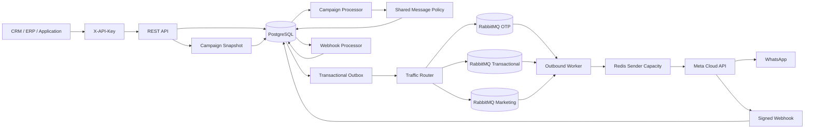

# apiWhatsApp

Enterprise-grade, multi-tenant WhatsApp Business Platform API for reliable high-volume messaging through Meta Cloud API.

## Current release: 0.8.0

The platform currently provides:

- NestJS + TypeScript REST API
- PostgreSQL + Prisma persistence and versioned migrations
- Tenant isolation with scoped API keys
- API key lifecycle and append-only audit logs
- Contacts, normalized tags, consent history, and 24-hour service windows
- Multiple WhatsApp senders per tenant with runtime secret references
- WABA template synchronization and lifecycle status tracking
- Local `APPROVED` template enforcement before outbox creation
- Server-derived traffic classes: `OTP`, `TRANSACTIONAL`, `MARKETING`
- Isolated RabbitMQ queues, retries, DLQs, and consumer prefetch by traffic class
- Priority-aware Redis sender capacity reservation
- Transactional outbox
- Signed Meta webhook ingestion and durable asynchronous processing
- Inbound message persistence and delivery receipt processing
- Marketing campaign orchestration with explicit audience snapshots
- Tag-based campaign segmentation
- Safe opt-in per-recipient template personalization
- Multi-replica campaign processing with leases and crash recovery
- Cursor-paginated message, template, campaign, recipient, and audit APIs
- OpenAPI / Swagger
- Docker-based local infrastructure

## Architecture



HTTP requests do not wait for WhatsApp delivery. Outbound messages and their outbox intents are committed atomically before asynchronous publishing and delivery.

Campaigns do not bypass the normal message path. Every campaign recipient becomes a normal idempotent template message through `MessagesService`, preserving sender ownership, current consent, approved-template validation, MARKETING routing, retry policy, outbox durability, and sender rate limits.

## Requirements

- Node.js 24+
- npm 11+
- Docker and Docker Compose
- Meta application with WhatsApp Business Platform access
- One or more WhatsApp Business phone numbers
- WABA ID for senders that use templates
- Meta access token for each configured sender
- Meta app secret and webhook verify token

## Local setup

```bash
cp .env.example .env
docker compose up -d
npm install
npm run prisma:generate
npm run prisma:deploy
npm run bootstrap:tenant -- --name="Acme" --slug=acme --key-name=bootstrap
```

The bootstrap command prints the raw tenant API key once. PostgreSQL stores only its HMAC-SHA256 digest.

Run the API and outbound worker separately:

```bash
npm run start:dev
npm run start:worker:dev
```

API: `http://localhost:3000/api`

Swagger: `http://localhost:3000/docs`

## Authentication and authorization

Business endpoints require:

```http
X-API-Key: wapi_<prefix>_<secret>
```

Tenant identity is derived only from the authenticated key. Supported scopes:

```text
messages:read
messages:write
contacts:read
contacts:write
phone_numbers:read
phone_numbers:write
templates:read
templates:write
campaigns:read
campaigns:write
api_keys:read
api_keys:write
audit:read
```

A delegated key cannot grant scopes that the actor key does not hold. Raw keys and key hashes are never returned by list or audit APIs.

## WhatsApp senders

Register sender metadata with a runtime credential reference:

```json
{
  "providerPhoneNumberId": "27681414235104944",
  "wabaId": "8856996819413533",
  "credentialRef": "env:META_ACME_WHATSAPP_TOKEN",
  "rateLimitPerSecond": 75,
  "isDefault": true
}
```

The referenced Meta access token is never stored in PostgreSQL.

```text
POST  /api/v1/phone-numbers
GET   /api/v1/phone-numbers
GET   /api/v1/phone-numbers/{senderId}
PATCH /api/v1/phone-numbers/{senderId}
```

## Template lifecycle

```text
POST /api/v1/templates/sync
GET  /api/v1/templates
GET  /api/v1/templates/{templateId}
```

Templates are synchronized at WABA level. The complete remote catalog must be read successfully before local deletion states are applied. Malformed or incomplete pagination aborts the synchronization.

Meta `message_template_status_update` webhook events update local lifecycle state. New template messages require an exact local `name + language + WABA` match with status `APPROVED`.

## Traffic classes and priority routing

Clients cannot submit message priority. The server derives it from trusted local metadata:

| Source | Traffic class |
| --- | --- |
| Approved `AUTHENTICATION` template | `OTP` |
| Approved `MARKETING` template | `MARKETING` |
| `UTILITY` or other approved template | `TRANSACTIONAL` |
| Free-form service reply | `TRANSACTIONAL` |

The class is persisted on `Message`, copied into the outbox intent, and verified by the worker before Meta is called.

Default RabbitMQ queues:

```text
whatsapp.outbound.otp
whatsapp.outbound.transactional
whatsapp.outbound.marketing
```

The legacy base queue remains consumed as transactional traffic during rolling upgrades.

## Contacts and segmentation tags

Contacts support normalized lowercase tags for deterministic segmentation:

```json
{
  "phone": "+96170123456",
  "name": "Jane Doe",
  "language": "en_US",
  "timezone": "Asia/Beirut",
  "tags": ["vip", "renewal:2026"],
  "metadata": {
    "plan": "gold",
    "points": 42
  }
}
```

Tags are validated as bounded slug-like values, normalized to lowercase, deduplicated, and stored in a PostgreSQL string array with a GIN index. Campaign tag filtering therefore does not depend on arbitrary JSON predicates.

## Campaigns

Campaigns are restricted to synchronized templates whose local state is exactly `APPROVED` and category is `MARKETING`. Sender and template must belong to the same WABA.

```text
POST /api/v1/campaigns
GET  /api/v1/campaigns
GET  /api/v1/campaigns/{campaignId}
GET  /api/v1/campaigns/{campaignId}/recipients
POST /api/v1/campaigns/{campaignId}/launch
POST /api/v1/campaigns/{campaignId}/pause
POST /api/v1/campaigns/{campaignId}/resume
POST /api/v1/campaigns/{campaignId}/cancel
```

### Explicit audience snapshot

A campaign must choose exactly one base audience:

- `allOptedIn=true`, or
- a non-empty `contactIds` list.

Optional `language`, `tagsAny`, and `tagsAll` filters only narrow that explicit base audience; they never implicitly expand it to all contacts.

Example:

```json
{
  "name": "VIP renewal offer",
  "senderId": "a5f4b844-1d12-437f-b7e5-702dd592da9d",
  "templateId": "31ee3b2f-5fbd-44bb-a4aa-b252a3a66c12",
  "audience": {
    "allOptedIn": true,
    "language": "en_US",
    "tagsAny": ["vip", "renewal:2026"],
    "tagsAll": ["marketing"]
  },
  "components": [],
  "scheduledAt": "2026-09-10T09:00:00Z"
}
```

Launch executes under a campaign row lock and repeatable-read transaction, selecting only currently `OPTED_IN` contacts and creating an immutable `CampaignRecipient` snapshot. `CAMPAIGN_MAX_RECIPIENTS` has an absolute 50,000-recipient safety cap in this release.

Consent is checked again immediately before message creation. A contact that opts out after snapshot creation is marked `SKIPPED` and receives no new message.

### Safe per-recipient personalization

Personalization is disabled by default for backward compatibility. Enable it explicitly:

```json
{
  "name": "Personalized VIP offer",
  "templateId": "31ee3b2f-5fbd-44bb-a4aa-b252a3a66c12",
  "audience": {
    "allOptedIn": true,
    "tagsAll": ["vip"]
  },
  "personalizationEnabled": true,
  "components": [
    {
      "type": "body",
      "parameters": [
        { "type": "text", "text": "{{contact.name}}" },
        { "type": "text", "text": "{{contact.metadata.plan}}" }
      ]
    }
  ]
}
```

Supported token sources:

```text
{{contact.name}}
{{contact.phone}}
{{contact.language}}
{{contact.timezone}}
{{contact.metadata.<top-level-scalar-key>}}
```

Safety rules:

- a token must occupy the entire string value;
- no JavaScript, JSONPath, function calls, concatenation expressions, or arbitrary code are evaluated;
- metadata access is limited to one top-level bounded key;
- resolved values must be scalar;
- component depth, node count, and token count are bounded;
- invalid token syntax is rejected when the draft is created;
- a missing recipient value marks only that recipient `SKIPPED`;
- a corrupt stored personalization template fails the campaign;
- when `personalizationEnabled` is omitted or false, `components` are passed through unchanged, including token-like strings.

`Campaign.personalizationEnabled` is a dedicated boolean column with database default `false`. Existing campaigns therefore retain static component semantics after migration, and campaign API responses expose the mode directly instead of mixing it into audience configuration.

### Processing and crash recovery

Recipients use PostgreSQL leases and `FOR UPDATE SKIP LOCKED`, allowing multiple application replicas to process campaigns concurrently without claiming the same recipient.

Both due `PENDING` recipients and expired `PROCESSING` leases are reclaimable. Each recipient has one deterministic message key:

```text
campaign:<campaignId>:contact:<contactId>
```

If a process creates the message and crashes before linking the recipient, a later processor first looks up that existing idempotent message and links it before re-evaluating campaign state, consent, or personalization. This preserves audit truth without creating duplicates.

`pause`, `resume`, `cancel`, failure, and completion use conditional state transitions so stale workers cannot overwrite newer lifecycle decisions.

`COMPLETED` is a campaign orchestration state: all snapshot recipients reached `QUEUED`, `SKIPPED`, `FAILED`, or `CANCELLED`. WhatsApp delivery state remains on each linked `Message`.

## Messaging API

```text
POST /api/v1/messages
GET  /api/v1/messages
GET  /api/v1/messages/{messageId}
```

Template messages require explicit `OPTED_IN` consent and an approved synchronized template. Free-form text requires an open 24-hour service window.

Outbound lifecycle:

```text
QUEUED -> PROCESSING -> SUBMITTED -> SENT -> DELIVERED -> READ
                              \
                               -> FAILED
```

## Webhooks

Configure Meta to use:

```text
GET/POST /api/v1/webhooks/meta/whatsapp
```

POST requests require a valid `X-Hub-Signature-256` generated with `META_APP_SECRET`.

Processing path:

```text
verify signature -> persist raw event -> HTTP 200 -> process asynchronously
```

The durable processor handles inbound messages, outbound delivery receipts, and template lifecycle updates before marking an event processed.

## Reliability defaults

- Transactional outbox
- Retry delays: `5s -> 30s -> 2m -> 10m -> DLQ`
- Per-message processing leases
- Per-sender Redis rate limiting
- Traffic-class-specific RabbitMQ consumer channels
- Campaign recipient leases with expired-claim recovery
- Deterministic campaign message idempotency
- Conditional campaign lifecycle transitions
- Durable signed webhook ingestion and retry

## Production commands

```bash
npm run prisma:generate
npm run build
npm run prisma:deploy
npm run start:prod
```

Worker:

```bash
npm run start:worker
```

## Important environment variables

```text
DATABASE_URL
REDIS_URL
RABBITMQ_URL
API_KEY_HASH_SECRET
META_GRAPH_API_VERSION
META_APP_SECRET
META_WEBHOOK_VERIFY_TOKEN
META_HTTP_TIMEOUT_MS
OUTBOUND_RETRY_DELAYS_MS
DEFAULT_OUTBOUND_RATE_LIMIT_PER_SECOND
OUTBOUND_WORKER_PREFETCH_OTP
OUTBOUND_WORKER_PREFETCH_TRANSACTIONAL
OUTBOUND_WORKER_PREFETCH_MARKETING
OUTBOUND_PRIORITY_RESERVATION_WINDOW_MS
OUTBOUND_TRANSACTIONAL_MAX_SHARE
OUTBOUND_MARKETING_MAX_SHARE
CAMPAIGN_MAX_RECIPIENTS
CAMPAIGN_PROCESSOR_INTERVAL_MS
CAMPAIGN_PROCESSOR_BATCH_SIZE
CAMPAIGN_PROCESSOR_LEASE_MS
CAMPAIGN_RECIPIENT_MAX_ATTEMPTS
```

Never commit production credentials or tokens.

## Next implementation slices

- campaign analytics tied to submitted, delivered, read, and failed message outcomes
- richer saved segments without arbitrary query expressions
- audit coverage for additional administrative configuration actions
- provider-backed secret stores beyond environment references
- media messages and media storage
- agent inbox and conversation assignment
- observability, readiness, tracing, and alerting
- integration and load tests
- dependency lockfile and supply-chain hardening

## Repository workflow

Changes are developed through feature branches and pull requests. Source code, tests, operational documentation, API names, and commit messages use English as the primary engineering language.
