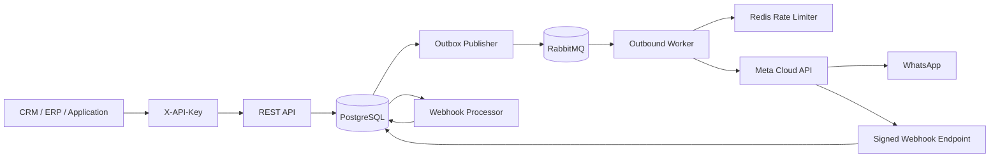

# apiWhatsApp

Enterprise-grade WhatsApp Business Platform API for reliable, high-volume messaging through Meta Cloud API.

## Engineering language

English is the primary language for source code, technical documentation, API contracts, commit messages, logs, and operational tooling.

## Current release scope

The current implementation provides a secure Core Messaging platform with:

- NestJS + TypeScript API
- PostgreSQL persistence with Prisma
- Tenant isolation and scoped API keys
- Contacts and immutable consent history
- Opt-out enforcement and template opt-in checks
- Transactional outbox between PostgreSQL and RabbitMQ
- Dedicated outbound worker process
- Redis-backed distributed outbound rate limiting
- Durable RabbitMQ queues, delayed retries, and dead-letter queue
- Meta WhatsApp Cloud API adapter
- Text and template outbound messages
- Tenant-scoped API idempotency
- Meta webhook verification and HMAC-SHA256 signature validation
- Durable webhook ingestion
- Asynchronous delivery status processing (`sent`, `delivered`, `read`, `failed`)
- Message status history
- OpenAPI / Swagger
- Docker-based local infrastructure
- Versioned database migrations

## Architecture



The HTTP request path never waits for WhatsApp delivery. A message is persisted together with an outbox event in one database transaction and is delivered asynchronously by the worker.

## Requirements

- Node.js 24+
- npm 11+
- Docker and Docker Compose
- A Meta application with WhatsApp Business Platform access
- A WhatsApp Business phone number ID
- A valid Meta access token
- A configured webhook verify token and Meta app secret

## Local setup

### 1. Configure environment

```bash
cp .env.example .env
```

Set a strong API-key hashing secret and the Meta values:

```text
API_KEY_HASH_SECRET=replace-with-at-least-32-random-bytes
META_GRAPH_API_VERSION=vXX.X
META_WHATSAPP_ACCESS_TOKEN=...
META_WHATSAPP_PHONE_NUMBER_ID=...
META_APP_SECRET=...
META_WEBHOOK_VERIFY_TOKEN=...
```

`META_GRAPH_API_VERSION` is intentionally configuration, not a hard-coded value. Set it to a Graph API version currently supported by your Meta application.

### 2. Start infrastructure

```bash
docker compose up -d
```

This starts PostgreSQL, Redis, RabbitMQ, and the RabbitMQ Management UI.

### 3. Install and prepare the database

```bash
npm install
npm run prisma:generate
npm run prisma:deploy
```

### 4. Provision a tenant and API key

```bash
npm run bootstrap:tenant -- --name="Acme" --slug=acme --key-name=local
```

The command creates or reuses the tenant and prints a new API key once. Store the raw key securely; only an HMAC-SHA256 digest is persisted in PostgreSQL.

### 5. Start the API and worker

```bash
npm run start:dev
```

In a separate terminal/process:

```bash
npm run start:worker:dev
```

API base URL:

```text
http://localhost:3000/api
```

Swagger UI:

```text
http://localhost:3000/docs
```

## Authentication and tenant isolation

All business API endpoints require:

```http
X-API-Key: wapi_<prefix>_<secret>
```

The only public HTTP surfaces are the health endpoint and Meta webhook endpoint. Meta webhook POST requests still require a valid `X-Hub-Signature-256`.

Supported API-key scopes:

- `messages:read`
- `messages:write`
- `contacts:read`
- `contacts:write`

Tenant identity is derived from the authenticated API key; clients cannot supply or override `tenantId` in business payloads.

## Contacts and consent

### Create a contact

```http
POST /api/v1/contacts
X-API-Key: <tenant-api-key>
Content-Type: application/json
```

```json
{
  "phone": "+96170123456",
  "name": "Jane Doe",
  "language": "en",
  "timezone": "Asia/Beirut",
  "metadata": {
    "crmId": "C-10042"
  }
}
```

### List and update contacts

```http
GET /api/v1/contacts
GET /api/v1/contacts/{contactId}
PATCH /api/v1/contacts/{contactId}
```

All contact lookups are tenant-scoped.

### Record consent

```http
POST /api/v1/contacts/{contactId}/consents
X-API-Key: <tenant-api-key>
Content-Type: application/json
```

```json
{
  "status": "OPTED_IN",
  "source": "website_checkout",
  "evidence": {
    "formVersion": "2026-09"
  }
}
```

Opt-out example:

```json
{
  "status": "OPTED_OUT",
  "source": "customer_request"
}
```

Consent changes update the contact's current state and append an immutable audit event. History is available at:

```http
GET /api/v1/contacts/{contactId}/consents
```

New outbound requests are blocked for opted-out contacts. Template messages require explicit `OPTED_IN` consent.

## REST messaging API

### Health

```http
GET /api/health
```

### Create outbound message

```http
POST /api/v1/messages
X-API-Key: <tenant-api-key>
Idempotency-Key: order-48291-confirmation
Content-Type: application/json
```

Text example:

```json
{
  "to": "+96170123456",
  "type": "TEXT",
  "payload": {
    "body": "Your order has been confirmed."
  }
}
```

Template example:

```json
{
  "to": "+96170123456",
  "type": "TEMPLATE",
  "payload": {
    "name": "order_confirmation",
    "language": "en_US",
    "components": [
      {
        "type": "body",
        "parameters": [
          { "type": "text", "text": "48291" }
        ]
      }
    ]
  }
}
```

Accepted response:

```json
{
  "messageId": "c7d63dd8-8ea0-4ed0-bfab-0de35eb40409",
  "status": "QUEUED",
  "createdAt": "2026-09-08T19:00:00.000Z"
}
```

### Get message status and history

```http
GET /api/v1/messages/{messageId}
X-API-Key: <tenant-api-key>
```

Messages cannot be retrieved across tenants.

Internal lifecycle:

```text
QUEUED -> PROCESSING -> SUBMITTED -> SENT -> DELIVERED -> READ
                              \
                               -> FAILED
```

## Idempotency

Clients should provide a stable `Idempotency-Key` header for each logical outbound message. Idempotency is scoped by tenant, so separate customers can safely use the same external key value without colliding.

The legacy body `idempotencyKey` remains temporarily supported but the HTTP header is preferred.

## Meta webhook

Configure Meta to use:

```text
GET/POST /api/v1/webhooks/meta/whatsapp
```

The GET endpoint handles Meta webhook verification. POST requests must contain a valid `X-Hub-Signature-256` generated with the configured Meta app secret.

Webhook requests follow this path:

```text
verify signature -> persist raw event -> return HTTP 200 -> process asynchronously
```

Delivery receipts update local messages using Meta's provider message ID. Status updates are monotonic so delayed events cannot normally downgrade a message from `READ` to `SENT`.

## Reliability model

### Transactional outbox

Message creation and queue intent are committed in the same PostgreSQL transaction. The outbox publisher retries RabbitMQ publication independently if the broker is temporarily unavailable.

### RabbitMQ retry policy

Default retry delays:

```text
5 seconds -> 30 seconds -> 2 minutes -> 10 minutes -> DLQ
```

Configure them with:

```text
OUTBOUND_RETRY_DELAYS_MS=5000,30000,120000,600000
```

### Distributed rate limiting

Workers share a Redis-backed per-phone-number rate limit:

```text
DEFAULT_OUTBOUND_RATE_LIMIT_PER_SECOND=75
```

This value must be aligned with the real throughput available to the connected WhatsApp number.

## Main environment variables

| Variable | Purpose |
| --- | --- |
| `DATABASE_URL` | PostgreSQL connection string |
| `REDIS_URL` | Redis connection string |
| `RABBITMQ_URL` | RabbitMQ connection string |
| `API_KEY_HASH_SECRET` | Server-side HMAC secret used to hash tenant API keys |
| `META_GRAPH_API_VERSION` | Explicit Meta Graph API version |
| `META_WHATSAPP_ACCESS_TOKEN` | Server-side Meta access token |
| `META_WHATSAPP_PHONE_NUMBER_ID` | WhatsApp Business phone number ID |
| `META_APP_SECRET` | Used to validate webhook signatures |
| `META_WEBHOOK_VERIFY_TOKEN` | Meta webhook verification token |
| `META_HTTP_TIMEOUT_MS` | Meta HTTP request timeout |
| `OUTBOUND_WORKER_PREFETCH` | RabbitMQ worker prefetch |
| `OUTBOUND_RETRY_DELAYS_MS` | Delayed retry policy |
| `DEFAULT_OUTBOUND_RATE_LIMIT_PER_SECOND` | Distributed outbound rate limit |
| `OUTBOX_POLL_INTERVAL_MS` | Transactional outbox polling interval |
| `WEBHOOK_PROCESSOR_INTERVAL_MS` | Pending webhook polling interval |

Never commit production credentials or tokens to this repository.

## Production processes

Build once:

```bash
npm run prisma:generate
npm run build
```

Run database migrations before starting a new application version:

```bash
npm run prisma:deploy
```

Run the HTTP API:

```bash
npm run start:prod
```

Run one or more outbound workers:

```bash
npm run start:worker
```

## Current limitations / next slices

Planned next implementation slices include:

- inbound WhatsApp message persistence
- 24-hour customer service window enforcement for free-form messages
- per-tenant WhatsApp phone-number configuration and credential resolution
- API-key lifecycle management endpoints and audit logging
- media messages and media storage
- template synchronization and lifecycle management
- priority queues for OTP / transactional / marketing traffic
- campaign orchestration and segmentation
- metrics, tracing, readiness checks, and alerting
- integration and load tests

## Repository workflow

Changes are developed through feature branches and pull requests. Keep implementation, tests, operational documentation, API names, and commit messages in English.
