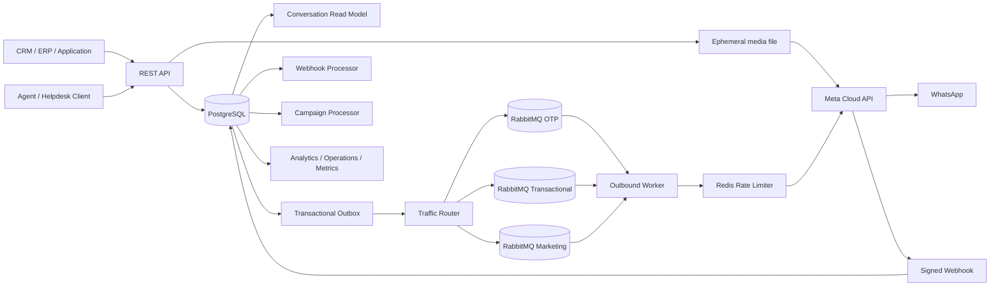

# apiWhatsApp

Enterprise-grade, multi-tenant WhatsApp Business Platform API for reliable high-volume messaging through Meta Cloud API.

## Current release: 0.18.0

Engineering language is English for source code, API contracts, tests, operational documentation, logs, and commit messages.

## Platform capabilities

- NestJS + TypeScript REST API
- PostgreSQL + Prisma persistence and versioned migrations
- Tenant isolation with scoped API keys
- API key lifecycle and append-only audit logs
- Contacts, consent history, normalized tags, and 24-hour service windows
- Reusable tenant contact segments with bounded/indexable predicates
- Multiple WhatsApp senders per tenant with runtime secret references
- WABA template synchronization and lifecycle tracking
- Local `APPROVED` template enforcement before outbound creation
- Outbound text plus image/video/audio/document media messaging
- Tenant-scoped direct media upload with bounded disk-backed multipart handling and MIME/content signature validation
- Server-derived traffic classes: `OTP`, `TRANSACTIONAL`, `MARKETING`
- Isolated RabbitMQ queues, retry queues, DLQs, and traffic-class prefetch
- Priority-aware Redis sender capacity reservation
- Transactional outbox
- Signed Meta webhook ingestion and durable asynchronous processing
- Inbound message persistence and delivery receipt processing
- Tenant-scoped agent inbox with conversation state, priority, assignment, unread counters, notes, and message history
- Durable marketing campaign orchestration with immutable audience snapshots
- Safe per-recipient template personalization
- Live campaign orchestration and WhatsApp delivery analytics
- Process liveness, dependency readiness, and tenant operations diagnostics
- Prometheus-compatible metrics and baseline alert rules
- W3C trace/request correlation across HTTP -> outbox -> RabbitMQ -> worker
- Committed npm lockfile, runtime vulnerability gate, and reproducible Docker build
- Real CI integration test against PostgreSQL, Redis, RabbitMQ, API, worker, and HTTP Meta mock
- Concurrent acceptance/drain load smoke gate
- OpenAPI / Swagger

## Architecture



Outbound message requests accept and persist work quickly; WhatsApp delivery is asynchronous. Message creation and the intent to publish are committed atomically before RabbitMQ publication.

Media upload is intentionally different: it is a bounded synchronous provider operation that writes one temporary file to disk, validates declared MIME/size plus a bounded content signature/container prefix, uploads it directly to Meta, returns the resulting media ID, and removes the temporary file in `finally`.

The agent inbox is an operational layer over the authoritative `Message` store. Conversation rows keep assignment/state/activity data; message payloads and provider lifecycle remain on `Message`.

Campaigns reuse the normal message pipeline. They cannot bypass tenant ownership, current consent, template approval, idempotency, priority routing, retries, outbox durability, or sender rate limits.

## Requirements

- Node.js 24+
- npm 11+
- Docker and Docker Compose
- PostgreSQL
- Redis
- RabbitMQ
- Meta application with WhatsApp Business Platform access
- One or more WhatsApp Business phone numbers
- WABA ID for template senders
- Meta access token for each configured sender
- Meta app secret and webhook verify token

## Local setup

```bash
cp .env.example .env
docker compose up -d
npm ci
npm run prisma:generate
npm run prisma:deploy
npm run bootstrap:tenant -- --name="Acme" --slug=acme --key-name=bootstrap
```

The bootstrap command displays a raw API key once. PostgreSQL stores only its HMAC-SHA256 digest.

Run API and worker separately:

```bash
npm run start:dev
npm run start:worker:dev
```

API: `http://localhost:3000/api`

Swagger: `http://localhost:3000/docs`

## Authentication and authorization

Business endpoints use:

```http
X-API-Key: wapi_<prefix>_<secret>
```

Tenant identity comes only from the authenticated key and is never accepted from the request payload.

Current scopes:

```text
messages:read
messages:write
media:write
contacts:read
contacts:write
phone_numbers:read
phone_numbers:write
templates:read
templates:write
campaigns:read
campaigns:write
segments:read
segments:write
inbox:read
inbox:write
operations:read
api_keys:read
api_keys:write
audit:read
```

A delegated API key cannot create another key with privileges it does not itself hold.

## Messaging API

```text
POST /api/v1/messages
GET  /api/v1/messages
GET  /api/v1/messages/{messageId}
```

Supported outbound types:

```text
TEXT
TEMPLATE
IMAGE
VIDEO
AUDIO
DOCUMENT
```

Template messages require explicit `OPTED_IN` consent and an approved synchronized template. Free-form text and media messages require an open customer-service window.

Media messages accept exactly one existing Meta media `id` or an absolute HTTPS `link`. Image/video/document can carry a bounded caption; document can also carry a bounded filename. See `docs/media-messaging.md`.

Outbound lifecycle:

```text
QUEUED -> PROCESSING -> SUBMITTED -> SENT -> DELIVERED -> READ
                              \
                               -> FAILED
```

Clients can use `Idempotency-Key` to obtain one logical message across retries.

## Media upload API

```text
POST /api/v1/media
Content-Type: multipart/form-data
Required scope: media:write
```

Multipart fields:

```text
file       required
senderId   optional tenant-scoped sender UUID
```

The endpoint writes one upload to OS/container temporary storage rather than buffering the full file in the Node.js heap. It validates the multipart field set, declared MIME type and size, cross-checks a bounded file signature/container prefix, resolves the sender inside the authenticated tenant, uploads to Meta with that sender's credential, returns the provider media ID, and deletes the temporary file on every service exit path.

Current local limits are intentionally at or below the provider limits:

| Category | Accepted MIME families | Max |
| --- | --- | ---: |
| Image | JPEG, PNG | 5 MB |
| Audio | AAC, MP4/M4A, MPEG/MP3, AMR, OGG | 16 MB |
| Video | MP4, 3GPP | 16 MB |
| Document | text, PDF, Word, Excel, PowerPoint legacy/OOXML | 100 MB |

Example response:

```json
{
  "mediaId": "<meta-media-id>",
  "senderId": "<internal-sender-id>",
  "category": "IMAGE",
  "mimeType": "image/jpeg",
  "size": 48123
}
```

The service does not persist uploaded binaries or an asset registry in the current media-upload foundation. It validates declared MIME/size and reads at most an 8 KiB prefix for signature/container checks before credentials/provider access. This is not malware scanning, codec validation, or complete Office/document parsing; controlled quarantine/object storage, malware/content scanning, and retention policy remain future hardening. See `docs/media-upload.md`.

## Senders and templates

Sender endpoints:

```text
POST  /api/v1/phone-numbers
GET   /api/v1/phone-numbers
GET   /api/v1/phone-numbers/{senderId}
PATCH /api/v1/phone-numbers/{senderId}
```

Sender credentials are stored as runtime references such as:

```text
env:META_ACME_WHATSAPP_TOKEN
```

Raw Meta sender tokens are not stored in PostgreSQL.

Template endpoints:

```text
POST /api/v1/templates/sync
GET  /api/v1/templates
GET  /api/v1/templates/{templateId}
```

Templates are synchronized at WABA level. New template messages require an exact local `name + language + WABA` match with status `APPROVED`.

## Priority routing

Clients cannot choose priority. The server derives traffic class from trusted synchronized metadata.

| Source | Traffic class |
| --- | --- |
| `AUTHENTICATION` template | `OTP` |
| `MARKETING` template | `MARKETING` |
| `UTILITY` / other approved template | `TRANSACTIONAL` |
| Free-form text/media service message | `TRANSACTIONAL` |

Default queues:

```text
whatsapp.outbound.otp
whatsapp.outbound.transactional
whatsapp.outbound.marketing
```

The persisted PostgreSQL traffic class is authoritative. Queue-class mismatches fail closed before Meta delivery.

## Contacts, consent, and segments

Contacts maintain current consent plus an immutable consent-event history. Opt-out blocks new outbound messages. Inbound messages update the customer-service window monotonically.

Saved segments support bounded criteria only:

```text
language
tagsAny
tagsAll
```

They do not accept SQL, JavaScript, JSONPath, or arbitrary expressions.

```text
POST  /api/v1/segments
GET   /api/v1/segments
GET   /api/v1/segments/{segmentId}
GET   /api/v1/segments/{segmentId}/count
PATCH /api/v1/segments/{segmentId}
```

Segment evaluation always adds tenant ownership and current `OPTED_IN` on the server.

## Agent inbox and conversations

The inbox uses the existing contact/sender/message records and adds tenant-scoped operational state. A logical conversation is unique by `tenant + sender + contact`.

Agent endpoints:

```text
POST  /api/v1/inbox/agents
GET   /api/v1/inbox/agents
PATCH /api/v1/inbox/agents/{agentId}
```

Conversation endpoints:

```text
GET   /api/v1/inbox/conversations
GET   /api/v1/inbox/conversations/{conversationId}
PATCH /api/v1/inbox/conversations/{conversationId}
POST  /api/v1/inbox/conversations/{conversationId}/read
GET   /api/v1/inbox/conversations/{conversationId}/messages
POST  /api/v1/inbox/conversations/{conversationId}/notes
```

Conversation states are `OPEN`, `PENDING`, and `RESOLVED`; priorities are `LOW`, `NORMAL`, `HIGH`, and `URGENT`.

Inbound messages create or reopen the sender/contact conversation and increment unread state atomically with the persisted message. Duplicate provider message IDs are discarded before unread is changed, and out-of-order inbound webhooks cannot move activity timestamps backwards.

Free-form outbound text/media messages reuse the same conversation and link `Message.conversationId` inside the existing Message + Outbox transaction. Template traffic deliberately does not auto-create or reopen inbox conversations, so marketing/authentication/utility templates and campaign volume do not flood the human-support queue.

Agent and conversation administrative mutations are tenant-scoped and audited without copying agent identity values, message content, notes, or contact data into audit metadata. Internal note content lives only in `ConversationNote`.

See `docs/inbox.md` for concurrency semantics, assignment behavior, integration coverage, and deliberate foundation boundaries.

## Campaigns

```text
POST /api/v1/campaigns
GET  /api/v1/campaigns
GET  /api/v1/campaigns/{campaignId}
GET  /api/v1/campaigns/{campaignId}/recipients
GET  /api/v1/campaigns/{campaignId}/analytics
POST /api/v1/campaigns/{campaignId}/launch
POST /api/v1/campaigns/{campaignId}/pause
POST /api/v1/campaigns/{campaignId}/resume
POST /api/v1/campaigns/{campaignId}/cancel
```

Campaigns require an approved `MARKETING` template. Audience mode must be exactly one of `allOptedIn=true`, non-empty `contactIds`, or an active saved `segmentId`.

Launch runs under a row lock and repeatable-read transaction, selects currently opted-in contacts, and creates an immutable `CampaignRecipient` snapshot. Recipient processing uses leases and `FOR UPDATE SKIP LOCKED`, allowing multiple replicas and crash recovery.

Each recipient has a deterministic logical message key:

```text
campaign:<campaignId>:contact:<contactId>
```

Personalization is opt-in and resolves only allowlisted full-value contact tokens. No code or expression language is evaluated.

## Webhooks

Meta webhook endpoint:

```text
GET/POST /api/v1/webhooks/meta/whatsapp
```

POST requests require a valid `X-Hub-Signature-256` generated with `META_APP_SECRET`.

Processing path:

```text
verify signature -> persist raw event -> HTTP 200 -> process asynchronously
```

The durable processor handles inbound messages, delivery receipts, and template lifecycle updates. Inbound message processing also updates the agent-inbox conversation in the same transaction as message persistence.

## Health, metrics, and trace correlation

Public probes:

```text
GET /api/health
GET /api/health/live
GET /api/health/ready
```

Readiness checks PostgreSQL, Redis, and RabbitMQ with bounded timeouts.

Tenant operational diagnostics:

```text
GET /api/v1/operations/snapshot
```

Prometheus metrics:

```text
GET /api/metrics
Authorization: Bearer <METRICS_BEARER_TOKEN>
```

Metrics labels are bounded and do not include tenant IDs, phones, message IDs, campaign IDs, payloads, raw dynamic paths, or user-provided strings.

Valid W3C `traceparent` and bounded `x-request-id` values propagate through HTTP, transactional outbox, RabbitMQ retry/DLQ flow, and outbound worker correlation. Span export to an external tracing backend remains a future slice.

See `docs/observability.md` and `ops/prometheus-alerts.yml`.

## Integration and load-smoke gate

The real-infrastructure integration job starts PostgreSQL 17, Redis 7, and RabbitMQ 4, applies production migrations, then runs the Nest API/worker against controlled test seams.

Core coverage proves:

```text
text/image message -> Message + Outbox -> RabbitMQ -> worker -> Redis -> Meta mock -> SUBMITTED
multipart media upload -> temporary disk file -> MIME/size + signature check -> tenant sender -> Meta mock /media -> mediaId
```

Inbox coverage proves:

```text
signed Meta webhook -> WebhookEvent -> inbound processor -> Contact + Conversation + Message
conversation -> mark read -> agent assignment -> priority/state -> note -> resolve
later inbound -> same conversation reopened + unread
free-form outbound -> same conversationId + transactional outbox
```

The integration gate also proves message idempotency and trace persistence, then sends a default 50-message concurrent burst and requires zero transport errors, HTTP 202 for every accept, unique internal IDs, bounded p95 acceptance, eventual `SUBMITTED`, and an exact provider delivery count.

This CI burst is a regression test, not a production throughput certification. Dedicated capacity and soak tests are still required for production sizing.

### Meta test seam

The normal Graph host remains `https://graph.facebook.com`.

`META_GRAPH_API_BASE_URL` exists for controlled testing. HTTP overrides are accepted only under `NODE_ENV=test`; non-test environments require HTTPS. Embedded URL credentials, query strings, and fragments are rejected.

See `docs/testing.md` for local execution, test boundaries, staged capacity profiles, and failure/concurrency coverage.

## Supply-chain and Docker policy

The repository commits `package-lock.json` and CI uses deterministic installs.

Development/CI:

```bash
npm ci
```

Production runtime:

```bash
npm ci --omit=dev --omit=peer --omit=optional --ignore-scripts
npm run audit:prod
```

CI blocks high/critical vulnerabilities present in the actual installed production runtime tree. Docker image construction is a required gate after build, runtime-security, and integration.

## CI gates

Every pull request must pass:

1. deterministic `npm ci`;
2. Prisma generation;
3. ESLint;
4. TypeScript/Nest build;
5. unit tests;
6. production-runtime security validation;
7. real PostgreSQL/Redis/RabbitMQ integration and load smoke;
8. production Docker image build.

## Important environment variables

```text
DATABASE_URL
REDIS_URL
RABBITMQ_URL
API_KEY_HASH_SECRET
HEALTH_DEPENDENCY_TIMEOUT_MS
METRICS_BEARER_TOKEN
META_GRAPH_API_VERSION
META_APP_SECRET
META_WEBHOOK_VERIFY_TOKEN
META_HTTP_TIMEOUT_MS
META_MEDIA_UPLOAD_TIMEOUT_MS
OUTBOUND_RETRY_DELAYS_MS
DEFAULT_OUTBOUND_RATE_LIMIT_PER_SECOND
CAMPAIGN_MAX_RECIPIENTS
```

See `.env.example` for the complete documented configuration set.

Never commit production credentials or access tokens.

## Version metadata

`package.json` is the runtime version source. `src/version.ts` reads it and supplies both the OpenAPI version and the `apiWhatsApp/<version>` User-Agent used by Meta clients, preventing per-client version drift.

## Next implementation slices

- production capacity / soak / new incident-driven failure-injection test expansion
- OpenTelemetry span export and tracing-backend integration
- provider-backed secret stores beyond environment references
- controlled media quarantine/object storage, malware/content scanning and retention
- realtime inbox delivery (SSE/WebSocket), teams/skills, routing policies, SLA/escalation and human-agent session/SSO integration
- optional inbox frontend application

## Repository workflow

Changes are developed through feature branches and pull requests. `main` is kept behind the complete CI gate chain listed above.
