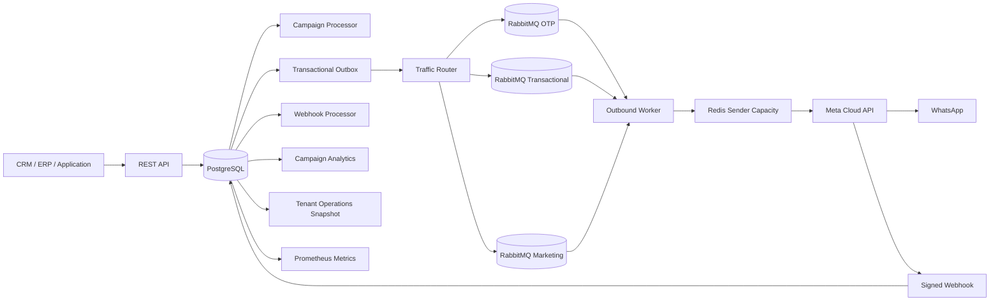

# apiWhatsApp

Enterprise-grade, multi-tenant WhatsApp Business Platform API for reliable high-volume messaging through Meta Cloud API.

## Current release: 0.13.0

Engineering language is English for source code, API contracts, tests, operational documentation, logs, and commit messages.

## Platform capabilities

- NestJS + TypeScript REST API
- PostgreSQL + Prisma persistence and versioned migrations
- Tenant isolation with scoped API keys
- API key lifecycle and append-only audit logs
- Contacts, normalized tags, consent history, and 24-hour service windows
- Reusable saved contact segments with bounded/indexable criteria
- Multiple WhatsApp senders per tenant with runtime secret references
- WABA template synchronization and lifecycle status tracking
- Local `APPROVED` template enforcement before message creation
- Server-derived traffic classes: `OTP`, `TRANSACTIONAL`, `MARKETING`
- Isolated RabbitMQ queues, retries, DLQs, and consumer prefetch by traffic class
- Priority-aware Redis sender capacity reservation
- Transactional outbox
- Signed Meta webhook ingestion and durable asynchronous processing
- Inbound message persistence and delivery receipt processing
- Marketing campaign orchestration with immutable audience snapshots
- Direct and saved-segment campaign targeting
- Safe opt-in per-recipient template personalization
- Multi-replica campaign processing with leases and crash recovery
- Live campaign orchestration and WhatsApp delivery analytics
- Public liveness and dependency readiness probes
- Tenant-scoped operational status/backlog diagnostics
- Prometheus-compatible process, HTTP, message, campaign, outbox, and webhook metrics
- W3C trace/request correlation across HTTP -> outbox -> RabbitMQ -> worker
- Baseline Prometheus alert rules
- Reproducible dependency installation with committed npm lockfile
- Production runtime high/critical vulnerability gate
- Reproducible multi-stage Docker build
- OpenAPI / Swagger

## Architecture



Outbound HTTP requests do not wait for WhatsApp delivery. Message creation and its outbox intent are committed atomically before RabbitMQ publication. Campaign sends reuse the normal `MessagesService` path and therefore cannot bypass tenant ownership, current consent, template approval, idempotency, priority routing, retries, or sender rate limits.

## Requirements

- Node.js 24+
- npm 11+
- Docker and Docker Compose
- PostgreSQL
- Redis
- RabbitMQ
- Meta application with WhatsApp Business Platform access
- One or more WhatsApp Business phone numbers
- WABA ID for template senders
- Meta access token for each configured sender
- Meta app secret and webhook verify token

## Local setup

```bash
cp .env.example .env
docker compose up -d
npm ci
npm run prisma:generate
npm run prisma:deploy
npm run bootstrap:tenant -- --name="Acme" --slug=acme --key-name=bootstrap
```

The bootstrap command prints the raw tenant API key once. PostgreSQL stores only its HMAC-SHA256 digest.

Run the API and worker separately:

```bash
npm run start:dev
npm run start:worker:dev
```

API: `http://localhost:3000/api`

Swagger: `http://localhost:3000/docs`

## Authentication and authorization

Business endpoints require:

```http
X-API-Key: wapi_<prefix>_<secret>
```

Tenant identity is derived only from the authenticated key and is never accepted from a client payload.

Current scopes:

```text
messages:read
messages:write
contacts:read
contacts:write
phone_numbers:read
phone_numbers:write
templates:read
templates:write
campaigns:read
campaigns:write
segments:read
segments:write
operations:read
api_keys:read
api_keys:write
audit:read
```

A delegated API key cannot grant scopes that the actor key does not already hold. Raw keys and key hashes are never returned by list or audit APIs.

## Messaging API

```text
POST /api/v1/messages
GET  /api/v1/messages
GET  /api/v1/messages/{messageId}
```

Template messages require explicit `OPTED_IN` consent and an approved synchronized template. Free-form text requires an open 24-hour customer service window.

Outbound lifecycle:

```text
QUEUED -> PROCESSING -> SUBMITTED -> SENT -> DELIVERED -> READ
                              \
                               -> FAILED
```

## WhatsApp senders

Register sender metadata with a runtime credential reference:

```json
{
  "providerPhoneNumberId": "27681414235104944",
  "wabaId": "8856996819413533",
  "credentialRef": "env:META_ACME_WHATSAPP_TOKEN",
  "rateLimitPerSecond": 75,
  "isDefault": true
}
```

Raw Meta sender access tokens are never stored in PostgreSQL.

```text
POST  /api/v1/phone-numbers
GET   /api/v1/phone-numbers
GET   /api/v1/phone-numbers/{senderId}
PATCH /api/v1/phone-numbers/{senderId}
```

## Template lifecycle

```text
POST /api/v1/templates/sync
GET  /api/v1/templates
GET  /api/v1/templates/{templateId}
```

Templates are synchronized at WABA level. Local deletion is applied only after the complete remote catalog has been read successfully. Malformed or incomplete provider pagination aborts synchronization.

Meta `message_template_status_update` webhooks update local lifecycle status. New template messages require an exact local `name + language + WABA` match with status `APPROVED`.

## Traffic classes and priority routing

Clients cannot choose message priority. The server derives it from trusted synchronized template metadata.

| Source | Traffic class |
| --- | --- |
| Approved `AUTHENTICATION` template | `OTP` |
| Approved `MARKETING` template | `MARKETING` |
| `UTILITY` or other approved template | `TRANSACTIONAL` |
| Free-form service reply | `TRANSACTIONAL` |

Default queues:

```text
whatsapp.outbound.otp
whatsapp.outbound.transactional
whatsapp.outbound.marketing
```

The traffic class is persisted on `Message`, copied into the outbox intent, and verified again by the worker before Meta is called.

## Contacts, consent, segments, and campaigns

Contacts support normalized lowercase tags and immutable consent history. Opt-out blocks new outbound messages. Inbound messages update the contact's last inbound timestamp and monotonically extend the customer service window.

Saved segments support bounded/indexable criteria only:

```text
language   exact match
tagsAny    contact has at least one tag
tagsAll    contact has every tag
```

Segments never accept arbitrary SQL, JSON predicates, JavaScript, JSONPath, or an expression language.

```text
POST  /api/v1/segments
GET   /api/v1/segments
GET   /api/v1/segments/{segmentId}
GET   /api/v1/segments/{segmentId}/count
PATCH /api/v1/segments/{segmentId}
```

Campaigns require an `APPROVED` `MARKETING` template on the selected sender WABA.

```text
POST /api/v1/campaigns
GET  /api/v1/campaigns
GET  /api/v1/campaigns/{campaignId}
GET  /api/v1/campaigns/{campaignId}/recipients
GET  /api/v1/campaigns/{campaignId}/analytics
POST /api/v1/campaigns/{campaignId}/launch
POST /api/v1/campaigns/{campaignId}/pause
POST /api/v1/campaigns/{campaignId}/resume
POST /api/v1/campaigns/{campaignId}/cancel
```

A campaign chooses exactly one base audience: `allOptedIn=true`, a non-empty `contactIds` list, or an active saved `segmentId`.

Launch runs under a row lock and repeatable-read transaction, selects only currently opted-in contacts, and creates an immutable `CampaignRecipient` snapshot. Saved segment definitions are copied into the campaign draft so later segment edits cannot silently alter an existing campaign. Recipients use PostgreSQL leases and `FOR UPDATE SKIP LOCKED`; expired `PROCESSING` leases are reclaimable.

Each recipient has a deterministic logical message key:

```text
campaign:<campaignId>:contact:<contactId>
```

Personalization is disabled by default. When explicitly enabled, only allowlisted full-value tokens such as `{{contact.name}}` and `{{contact.metadata.plan}}` are resolved. No JavaScript, JSONPath, function calls, concatenation expressions, or arbitrary code are executed.

## Webhooks

Configure Meta to use:

```text
GET/POST /api/v1/webhooks/meta/whatsapp
```

POST requests require a valid `X-Hub-Signature-256` generated with `META_APP_SECRET`.

```text
verify signature -> persist raw event -> HTTP 200 -> process asynchronously
```

The durable processor handles inbound messages, outbound delivery receipts, and template lifecycle updates before marking an event processed.

## Health and operational diagnostics

Public probes:

```text
GET /api/health
GET /api/health/live
GET /api/health/ready
```

`/api/health` remains a backward-compatible liveness alias. Liveness does not call external dependencies. Readiness checks PostgreSQL, Redis, and RabbitMQ concurrently with a bounded timeout and returns HTTP `503` when any required dependency is unavailable.

Tenant diagnostics require `operations:read`:

```text
GET /api/v1/operations/snapshot
```

The snapshot exposes counters only: message status, traffic class, campaign status, recipient status, and tenant-owned transactional-outbox backlog. It does not return phone numbers, contact IDs, message bodies, provider payloads, or credentials.

## Metrics, correlation, and alerting

Release `0.13.0` adds Prometheus-compatible metrics and W3C trace/request correlation without adding a new observability SDK to the runtime dependency graph.

Metrics endpoint:

```text
GET /api/metrics
Authorization: Bearer <METRICS_BEARER_TOKEN>
```

`METRICS_BEARER_TOKEN` must contain at least 32 characters. When it is missing or too short, the endpoint fails closed with HTTP `503`. This token is independent of tenant API keys and Meta credentials.

Exported telemetry includes:

- process uptime and memory;
- HTTP request totals and duration histograms;
- messages by current status;
- campaigns and campaign recipients by status;
- transactional outbox pending/due/leased/oldest age;
- durable webhook pending/due/leased/oldest age.

HTTP metric labels are intentionally limited to `method`, `controller`, `handler`, and `status_code`. Raw URLs, tenant IDs, phone numbers, message IDs, campaign IDs, error text, and user-provided strings are not used as Prometheus labels.

Incoming valid W3C `traceparent` headers are continued with a new server span ID. Responses include the current `traceparent` and a bounded `x-request-id`. For newly-created outbound messages, the correlation carrier is persisted in the existing outbox JSON and propagated through RabbitMQ publish/retry/DLQ before a new worker span is created. Legacy messages without trace metadata continue to work.

`0.13.0` provides trace correlation and W3C-compatible propagation; it does **not** yet export spans to an OpenTelemetry/Jaeger/Tempo/Datadog-style tracing backend.

Operational details:

- `docs/observability.md` — scrape, correlation, cardinality, security, and dashboard runbook
- `ops/prometheus-alerts.yml` — baseline alert rules for target down, stalled outbox, stalled webhooks, and elevated HTTP 5xx rate

## Supply-chain and build reproducibility

The repository uses a committed npm lockfile and deterministic installation policy.

Development/CI:

```bash
npm ci
```

Production runtime:

```bash
npm ci --omit=dev --omit=peer --omit=optional --ignore-scripts
npm run audit:prod
```

CI fails when a high or critical advisory affects a package physically installed in the production runtime tree. The production Docker image is built from the same lockfile and Docker construction is a merge gate.

## Production build

```bash
npm ci
npm run prisma:generate
npm run build
npm run prisma:deploy
npm run start:prod
```

Worker:

```bash
npm run start:worker
```

Container:

```bash
docker build -t api-whatsapp .
```

## Important environment variables

```text
DATABASE_URL
REDIS_URL
RABBITMQ_URL
API_KEY_HASH_SECRET
HEALTH_DEPENDENCY_TIMEOUT_MS
METRICS_BEARER_TOKEN
META_GRAPH_API_VERSION
META_APP_SECRET
META_WEBHOOK_VERIFY_TOKEN
META_HTTP_TIMEOUT_MS
OUTBOUND_RETRY_DELAYS_MS
DEFAULT_OUTBOUND_RATE_LIMIT_PER_SECOND
OUTBOUND_WORKER_PREFETCH_OTP
OUTBOUND_WORKER_PREFETCH_TRANSACTIONAL
OUTBOUND_WORKER_PREFETCH_MARKETING
OUTBOUND_PRIORITY_RESERVATION_WINDOW_MS
OUTBOUND_TRANSACTIONAL_MAX_SHARE
OUTBOUND_MARKETING_MAX_SHARE
CAMPAIGN_MAX_RECIPIENTS
CAMPAIGN_PROCESSOR_INTERVAL_MS
CAMPAIGN_PROCESSOR_BATCH_SIZE
CAMPAIGN_PROCESSOR_LEASE_MS
CAMPAIGN_RECIPIENT_MAX_ATTEMPTS
```

Never commit production credentials or access tokens.

## Next implementation slices

- OpenTelemetry span export and tracing-backend integration
- integration and load tests
- additional administrative audit coverage
- provider-backed secret stores beyond environment references
- media messages and media storage
- agent inbox and conversation assignment

## Repository workflow

Changes are developed through feature branches and pull requests. Pull requests must pass deterministic dependency installation, Prisma generation, lint, TypeScript/Nest build, unit tests, production-runtime security validation, and Docker image construction before merge.
