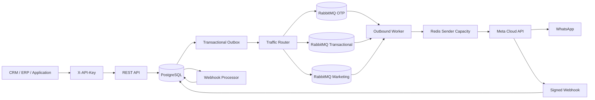

# apiWhatsApp

Enterprise-grade, multi-tenant WhatsApp Business Platform API for reliable high-volume messaging through Meta Cloud API.

## Current release: 0.6.0

The platform currently provides:

- NestJS + TypeScript REST API
- PostgreSQL + Prisma persistence
- Tenant isolation with scoped API keys
- API key lifecycle and append-only tenant audit logs
- Contacts, consent history, and 24-hour customer service windows
- Multiple WhatsApp senders per tenant
- Runtime secret references instead of raw Meta tokens in PostgreSQL
- WABA template synchronization and lifecycle status tracking
- Local `APPROVED` template enforcement before outbox creation
- Server-derived traffic classes: `OTP`, `TRANSACTIONAL`, `MARKETING`
- Isolated RabbitMQ queues/retries/DLQs and consumer prefetch per traffic class
- Priority-aware Redis sender capacity reservation with late-window borrowing
- Transactional outbox
- Inbound message persistence and signed Meta webhooks
- Delivery status processing (`sent`, `delivered`, `read`, `failed`)
- Cursor-paginated message, template, and audit APIs
- OpenAPI / Swagger
- Docker-based local infrastructure
- Versioned database migrations

## Architecture



Outbound HTTP requests never wait for WhatsApp delivery. A message and its outbox intent are committed atomically, then published to the queue selected from the persisted server-derived traffic class.

## Requirements

- Node.js 24+
- npm 11+
- Docker and Docker Compose
- Meta application with WhatsApp Business Platform access
- One or more WhatsApp Business phone numbers
- WABA ID configured for senders that use templates
- Meta access token for every configured sender
- Meta app secret and webhook verify token

## Local setup

```bash
cp .env.example .env
docker compose up -d
npm install
npm run prisma:generate
npm run prisma:deploy
npm run bootstrap:tenant -- --name="Acme" --slug=acme --key-name=bootstrap
```

The bootstrap command prints the raw API key once. PostgreSQL stores only its HMAC-SHA256 digest.

Run API and worker in separate processes:

```bash
npm run start:dev
npm run start:worker:dev
```

API: `http://localhost:3000/api`

Swagger: `http://localhost:3000/docs`

## Authentication and authorization

Business endpoints require:

```http
X-API-Key: wapi_<prefix>_<secret>
```

Tenant identity comes exclusively from the authenticated key. Supported scopes:

```text
messages:read
messages:write
contacts:read
contacts:write
phone_numbers:read
phone_numbers:write
templates:read
templates:write
api_keys:read
api_keys:write
audit:read
```

API key lifecycle:

```text
POST /api/v1/api-keys
GET  /api/v1/api-keys
POST /api/v1/api-keys/{apiKeyId}/revoke
GET  /api/v1/audit-logs
```

A delegated key cannot grant scopes the actor key does not hold. Raw keys and key hashes are excluded from list/audit responses.

## WhatsApp senders

Register sender metadata with a runtime credential reference:

```json
{
  "providerPhoneNumberId": "27681414235104944",
  "wabaId": "8856996819413533",
  "credentialRef": "env:META_ACME_WHATSAPP_TOKEN",
  "rateLimitPerSecond": 75,
  "isDefault": true
}
```

The referenced Meta token is never stored in PostgreSQL.

```text
POST  /api/v1/phone-numbers
GET   /api/v1/phone-numbers
GET   /api/v1/phone-numbers/{senderId}
PATCH /api/v1/phone-numbers/{senderId}
```

## Template lifecycle

```text
POST /api/v1/templates/sync
GET  /api/v1/templates
GET  /api/v1/templates/{templateId}
```

Templates are synchronized at WABA level through the selected/default tenant sender. The complete remote catalog is read before local changes are applied. Malformed/incomplete pagination aborts synchronization rather than marking missing rows deleted.

Meta `message_template_status_update` webhook events update the local lifecycle state. New template messages require an exact local `name + language + WABA` match with status `APPROVED`.

## Traffic classes and priority routing

Clients do **not** submit a priority field. The server derives `MessageTrafficClass` from trusted local metadata:

| Message/template source | Persisted traffic class |
| --- | --- |
| Approved `AUTHENTICATION` template | `OTP` |
| Approved `MARKETING` template | `MARKETING` |
| `UTILITY` or other approved template | `TRANSACTIONAL` |
| Free-form `TEXT` service reply | `TRANSACTIONAL` |

This prevents a marketing integration from self-labeling traffic as OTP.

The class is persisted on `Message`, copied into the transactional outbox intent, and verified again by the worker. A RabbitMQ job whose queue class differs from the persisted message class is failed and dead-lettered before calling Meta.

### RabbitMQ topology

With the default base queue `whatsapp.outbound`, the release uses:

```text
whatsapp.outbound.otp
whatsapp.outbound.transactional
whatsapp.outbound.marketing
```

Each class has independent retry queues and a DLQ. The worker uses a dedicated consumer channel/prefetch for each class:

```text
OUTBOUND_WORKER_PREFETCH_OTP=10
OUTBOUND_WORKER_PREFETCH_TRANSACTIONAL=20
OUTBOUND_WORKER_PREFETCH_MARKETING=5
```

The legacy `whatsapp.outbound` queue remains consumed as `TRANSACTIONAL` so pre-0.6 messages and legacy retry queues can drain safely during rollout.

### Priority-aware sender capacity

All traffic still shares the configured per-phone-number total rate limit. During the first part of every one-second Redis window, lower classes are capped to preserve high-priority headroom:

```text
OUTBOUND_PRIORITY_RESERVATION_WINDOW_MS=700
OUTBOUND_TRANSACTIONAL_MAX_SHARE=0.60
OUTBOUND_MARKETING_MAX_SHARE=0.20
```

With the defaults, the first 700 ms reserves at least 20% total headroom for OTP. During the final 300 ms, any class may borrow unused total capacity so throughput is not unnecessarily discarded.

The total Redis counter deliberately retains the pre-0.6 key format. Old and new workers therefore enforce one shared sender limit during a rolling deployment instead of accidentally doubling throughput.

Custom transactional + marketing shares above 90% are rejected in favor of the safe defaults so the reservation phase always keeps OTP headroom.

## Messaging API

Send:

```http
POST /api/v1/messages
X-API-Key: <tenant-api-key>
Idempotency-Key: order-48291-confirmation
Content-Type: application/json
```

Template example:

```json
{
  "to": "+96170123456",
  "type": "TEMPLATE",
  "senderId": "a5f4b844-1d12-437f-b7e5-702dd592da9d",
  "payload": {
    "name": "order_confirmation",
    "language": "en_US",
    "components": []
  }
}
```

Free-form text is allowed only inside the contact's open 24-hour customer service window. Template messages require explicit `OPTED_IN` consent and an approved synchronized template.

List/read:

```text
GET /api/v1/messages
GET /api/v1/messages/{messageId}
```

`GET /api/v1/messages` can filter by `trafficClass=OTP|TRANSACTIONAL|MARKETING` in addition to the existing direction/status/phone/sender filters.

Outbound lifecycle:

```text
QUEUED -> PROCESSING -> SUBMITTED -> SENT -> DELIVERED -> READ
                              \
                               -> FAILED
```

## Webhooks

Configure Meta to use:

```text
GET/POST /api/v1/webhooks/meta/whatsapp
```

POST requests require a valid `X-Hub-Signature-256` generated with `META_APP_SECRET`.

Processing path:

```text
verify signature -> persist raw event -> HTTP 200 -> process asynchronously
```

The durable processor handles inbound messages, outbound delivery receipts, and template lifecycle updates before marking a webhook event processed.

## Reliability defaults

- Transactional outbox for queue intent
- Retry delays: `5s -> 30s -> 2m -> 10m -> DLQ`
- Per-message processing leases
- Per-sender Redis rate limiting
- Class-specific RabbitMQ consumer channels
- Legacy queue draining during 0.6 rollout
- Durable webhook ingestion/retry

## Production commands

```bash
npm run prisma:generate
npm run build
npm run prisma:deploy
npm run start:prod
```

Worker:

```bash
npm run start:worker
```

## Important environment variables

```text
DATABASE_URL
REDIS_URL
RABBITMQ_URL
API_KEY_HASH_SECRET
META_GRAPH_API_VERSION
META_APP_SECRET
META_WEBHOOK_VERIFY_TOKEN
META_HTTP_TIMEOUT_MS
OUTBOUND_RETRY_DELAYS_MS
DEFAULT_OUTBOUND_RATE_LIMIT_PER_SECOND
OUTBOUND_WORKER_PREFETCH_OTP
OUTBOUND_WORKER_PREFETCH_TRANSACTIONAL
OUTBOUND_WORKER_PREFETCH_MARKETING
OUTBOUND_PRIORITY_RESERVATION_WINDOW_MS
OUTBOUND_TRANSACTIONAL_MAX_SHARE
OUTBOUND_MARKETING_MAX_SHARE
```

Never commit production credentials or tokens.

## Next implementation slices

- campaign orchestration and segmentation on top of `MARKETING` traffic
- audit coverage for additional administrative configuration actions
- provider-backed secret stores beyond environment references
- media messages and media storage
- agent inbox / conversation assignment
- observability, readiness, tracing, and alerting
- integration and load tests
- dependency lockfile and supply-chain hardening

## Repository workflow

Changes are developed through feature branches and pull requests. Keep implementation, tests, operational documentation, API names, and commit messages in English.
