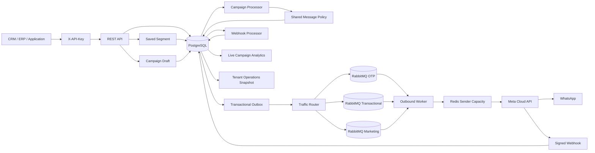

# apiWhatsApp

Enterprise-grade, multi-tenant WhatsApp Business Platform API for reliable high-volume messaging through Meta Cloud API.

## Current release: 0.11.0

The platform currently provides:

- NestJS + TypeScript REST API
- PostgreSQL + Prisma persistence and versioned migrations
- Tenant isolation with scoped API keys
- API key lifecycle and append-only audit logs
- Contacts, normalized tags, consent history, and 24-hour service windows
- Reusable saved contact segments with bounded/indexable criteria
- Multiple WhatsApp senders per tenant with runtime secret references
- WABA template synchronization and lifecycle status tracking
- Local `APPROVED` template enforcement before outbox creation
- Server-derived traffic classes: `OTP`, `TRANSACTIONAL`, `MARKETING`
- Isolated RabbitMQ queues, retries, DLQs, and consumer prefetch by traffic class
- Priority-aware Redis sender capacity reservation
- Transactional outbox
- Signed Meta webhook ingestion and durable asynchronous processing
- Inbound message persistence and delivery receipt processing
- Marketing campaign orchestration with immutable audience snapshots
- Direct and saved-segment campaign targeting
- Safe opt-in per-recipient template personalization
- Multi-replica campaign processing with leases and crash recovery
- Live campaign orchestration and WhatsApp delivery analytics
- Public process liveness and dependency readiness probes
- Tenant-scoped operational status/backlog diagnostics
- Cursor-paginated message, template, campaign, recipient, and audit APIs
- OpenAPI / Swagger
- Docker-based local infrastructure

## Architecture



HTTP requests do not wait for WhatsApp delivery. Outbound messages and their outbox intents are committed atomically before asynchronous publishing and delivery.

Campaigns reuse the normal message path. Every campaign recipient becomes an idempotent template message through `MessagesService`, preserving sender ownership, current consent, approved-template validation, MARKETING routing, retries, outbox durability, and sender rate limits.

## Requirements

- Node.js 24+
- npm 11+
- Docker and Docker Compose
- Meta application with WhatsApp Business Platform access
- One or more WhatsApp Business phone numbers
- WABA ID for senders that use templates
- Meta access token for each configured sender
- Meta app secret and webhook verify token

## Local setup

```bash
cp .env.example .env
docker compose up -d
npm install
npm run prisma:generate
npm run prisma:deploy
npm run bootstrap:tenant -- --name="Acme" --slug=acme --key-name=bootstrap
```

The bootstrap command prints the raw tenant API key once. PostgreSQL stores only its HMAC-SHA256 digest.

Run the API and outbound worker separately:

```bash
npm run start:dev
npm run start:worker:dev
```

API: `http://localhost:3000/api`

Swagger: `http://localhost:3000/docs`

## Authentication and authorization

Business endpoints require:

```http
X-API-Key: wapi_<prefix>_<secret>
```

Tenant identity is derived only from the authenticated key. Supported scopes:

```text
messages:read
messages:write
contacts:read
contacts:write
phone_numbers:read
phone_numbers:write
templates:read
templates:write
campaigns:read
campaigns:write
segments:read
segments:write
operations:read
api_keys:read
api_keys:write
audit:read
```

A delegated key cannot grant scopes that the actor key does not hold. Raw keys and key hashes are never returned by list or audit APIs.

## Operational health and diagnostics

Liveness and readiness are intentionally separate.

```text
GET /api/health
GET /api/health/live
GET /api/health/ready
```

`/api/health` remains a backward-compatible alias for process-only liveness. Liveness does not call PostgreSQL, Redis, RabbitMQ, Meta, or any other remote dependency.

`/api/health/ready` concurrently checks PostgreSQL, Redis, and RabbitMQ with a bounded per-dependency timeout. It returns HTTP `200` only when all required dependencies are available and HTTP `503` with a structured dependency report otherwise. `HEALTH_DEPENDENCY_TIMEOUT_MS` defaults to `1500` ms and is bounded by the application.

The public health response contains only dependency status, duration, and a coarse error classification (`not_configured`, `timeout`, or `unavailable`). It does not expose connection strings, broker topology, credentials, payloads, or exception text.

Tenant operational diagnostics require `operations:read`:

```text
GET /api/v1/operations/snapshot
```

The snapshot includes only tenant-scoped counters:

- message counts by current status;
- outbound message counts by server-derived traffic class;
- campaign counts by lifecycle status;
- campaign-recipient counts by orchestration status;
- unpublished transactional-outbox counts (`pending`, `due`, `leased`, `withErrors`);
- age in seconds of the tenant's oldest unpublished message outbox event.

Outbox metrics are joined through the tenant's persisted `Message` rows and restricted to the `message.outbound.requested` event. The API does not return message/customer identifiers, phone numbers, provider payloads, message bodies, or credentials.

Global webhook backlog is deliberately not exposed by this tenant endpoint because `WebhookEvent` is not tenant-attributed in the current data model.

## WhatsApp senders

Register sender metadata with a runtime credential reference:

```json
{
  "providerPhoneNumberId": "27681414235104944",
  "wabaId": "8856996819413533",
  "credentialRef": "env:META_ACME_WHATSAPP_TOKEN",
  "rateLimitPerSecond": 75,
  "isDefault": true
}
```

The referenced Meta access token is never stored in PostgreSQL.

```text
POST  /api/v1/phone-numbers
GET   /api/v1/phone-numbers
GET   /api/v1/phone-numbers/{senderId}
PATCH /api/v1/phone-numbers/{senderId}
```

## Template lifecycle

```text
POST /api/v1/templates/sync
GET  /api/v1/templates
GET  /api/v1/templates/{templateId}
```

Templates are synchronized at WABA level. The complete remote catalog must be read successfully before local deletion states are applied. Malformed or incomplete pagination aborts synchronization.

Meta `message_template_status_update` webhook events update local lifecycle state. New template messages require an exact local `name + language + WABA` match with status `APPROVED`.

## Traffic classes and priority routing

Clients cannot submit priority. The server derives it from trusted local metadata:

| Source | Traffic class |
| --- | --- |
| Approved `AUTHENTICATION` template | `OTP` |
| Approved `MARKETING` template | `MARKETING` |
| `UTILITY` or other approved template | `TRANSACTIONAL` |
| Free-form service reply | `TRANSACTIONAL` |

The class is persisted on `Message`, copied into the outbox intent, and verified by the worker before Meta is called.

Default RabbitMQ queues:

```text
whatsapp.outbound.otp
whatsapp.outbound.transactional
whatsapp.outbound.marketing
```

The legacy base queue remains consumed as transactional traffic during rolling upgrades.

## Contacts and tags

Contacts support normalized lowercase tags:

```json
{
  "phone": "+96170123456",
  "name": "Jane Doe",
  "language": "en_US",
  "timezone": "Asia/Beirut",
  "tags": ["vip", "renewal:2026"],
  "metadata": {
    "plan": "gold",
    "points": 42
  }
}
```

Tags are validated as bounded slug-like values, normalized to lowercase, deduplicated, and stored in a PostgreSQL string array with a GIN index.

## Saved contact segments

Reusable segments are tenant-scoped named definitions over bounded, indexable contact attributes. They do not accept arbitrary JSON predicates, SQL fragments, JavaScript, JSONPath, or expression languages.

Supported criteria:

```text
language   exact match
tagsAny    contact has at least one tag
tagsAll    contact has every tag
```

Every saved segment must contain at least one criterion. Segment evaluation always adds tenant ownership and `OPTED_IN` on the server.

Endpoints:

```text
POST  /api/v1/segments
GET   /api/v1/segments
GET   /api/v1/segments/{segmentId}
GET   /api/v1/segments/{segmentId}/count
PATCH /api/v1/segments/{segmentId}
```

Example:

```json
{
  "name": "VIP renewals",
  "description": "Opted-in VIP contacts eligible for renewal campaigns.",
  "definition": {
    "language": "en_US",
    "tagsAny": ["renewal:2026", "vip"],
    "tagsAll": ["marketing"]
  }
}
```

Definitions are normalized before persistence. `GET /segments/{id}/count` evaluates the current contact population and returns an observation timestamp. Inactive segments remain readable/countable for administration but cannot be attached to a new campaign.

## Campaigns

Campaigns require a synchronized `APPROVED` `MARKETING` template. Sender and template must belong to the same WABA.

```text
POST /api/v1/campaigns
GET  /api/v1/campaigns
GET  /api/v1/campaigns/{campaignId}
GET  /api/v1/campaigns/{campaignId}/recipients
GET  /api/v1/campaigns/{campaignId}/analytics
POST /api/v1/campaigns/{campaignId}/launch
POST /api/v1/campaigns/{campaignId}/pause
POST /api/v1/campaigns/{campaignId}/resume
POST /api/v1/campaigns/{campaignId}/cancel
```

### Explicit audience modes

A campaign must choose exactly one base audience:

- `allOptedIn=true`;
- a non-empty `contactIds` list; or
- an active saved `segmentId`.

Direct `language`, `tagsAny`, and `tagsAll` filters can narrow the first two modes. They cannot be combined with `segmentId` because a saved segment already owns its definition.

Example using a saved segment:

```json
{
  "name": "September VIP renewal",
  "senderId": "a5f4b844-1d12-437f-b7e5-702dd592da9d",
  "templateId": "31ee3b2f-5fbd-44bb-a4aa-b252a3a66c12",
  "audience": {
    "segmentId": "f6e7b52b-03a2-4b13-84f9-f616de5d34f2"
  },
  "scheduledAt": "2026-09-10T09:00:00Z"
}
```

When the draft is created, the service resolves only an active segment owned by the authenticated tenant and copies the normalized definition into `Campaign.audience` together with source metadata (`segmentId`, `segmentName`, `segmentUpdatedAt`).

This copy is intentional. Launch never re-reads the live segment. Editing or deactivating the saved segment later does not silently change the definition of a campaign draft that already exists.

Launch executes under a campaign row lock and repeatable-read transaction, selecting only currently `OPTED_IN` contacts and creating an immutable `CampaignRecipient` snapshot. `CAMPAIGN_MAX_RECIPIENTS` has an absolute 50,000-recipient safety cap.

Consent is checked again immediately before message creation. A contact that opts out after the snapshot is marked `SKIPPED` and receives no new message.

### Safe per-recipient personalization

Personalization is disabled by default. Enable it explicitly with `personalizationEnabled=true`.

Supported full-value token sources:

```text
{{contact.name}}
{{contact.phone}}
{{contact.language}}
{{contact.timezone}}
{{contact.metadata.<top-level-scalar-key>}}
```

No JavaScript, JSONPath, function calls, concatenation expressions, or arbitrary code are evaluated. A token must occupy the complete string value. Missing recipient values mark only that recipient `SKIPPED`.

`Campaign.personalizationEnabled` is a dedicated boolean column with database default `false`, so campaigns created before personalization retain static component semantics.

### Processing and crash recovery

Recipients use PostgreSQL leases and `FOR UPDATE SKIP LOCKED`, allowing multiple application replicas to process campaigns without claiming the same recipient.

Both due `PENDING` recipients and expired `PROCESSING` leases are reclaimable. Each recipient has one deterministic message key:

```text
campaign:<campaignId>:contact:<contactId>
```

If a process creates the message and crashes before linking the recipient, a later processor first looks up that existing message before re-evaluating campaign state, consent, or personalization.

`COMPLETED` is an orchestration state: all snapshot recipients reached `QUEUED`, `SKIPPED`, `FAILED`, or `CANCELLED`. WhatsApp delivery state remains on each linked `Message`.

### Live campaign analytics

```text
GET /api/v1/campaigns/{campaignId}/analytics
```

The endpoint requires `campaigns:read`, verifies tenant ownership, and reads directly from authoritative `CampaignRecipient` and linked `Message` records.

It returns orchestration status counts, cumulative created/submitted/sent/delivered/read/failed milestones, current message status distribution, consistency signaling, and percentage rates:

```text
messageCreationRate = created / snapshotRecipients
submissionRate      = submitted / created
deliveryRate        = delivered / submitted
readRate            = read / delivered
failureRate         = failed / created
```

Rates use a `0-100` scale and are `null` when the denominator is zero. Analytics are live observations and include `generatedAt`.

## Messaging API

```text
POST /api/v1/messages
GET  /api/v1/messages
GET  /api/v1/messages/{messageId}
```

Template messages require explicit `OPTED_IN` consent and an approved synchronized template. Free-form text requires an open 24-hour service window.

Outbound lifecycle:

```text
QUEUED -> PROCESSING -> SUBMITTED -> SENT -> DELIVERED -> READ
                              \
                               -> FAILED
```

## Webhooks

Configure Meta to use:

```text
GET/POST /api/v1/webhooks/meta/whatsapp
```

POST requests require a valid `X-Hub-Signature-256` generated with `META_APP_SECRET`.

Processing path:

```text
verify signature -> persist raw event -> HTTP 200 -> process asynchronously
```

The durable processor handles inbound messages, outbound delivery receipts, and template lifecycle updates before marking an event processed.

## Reliability defaults

- Transactional outbox
- Retry delays: `5s -> 30s -> 2m -> 10m -> DLQ`
- Per-message processing leases
- Per-sender Redis rate limiting
- Traffic-class-specific RabbitMQ consumer channels
- Campaign recipient leases with expired-claim recovery
- Deterministic campaign message idempotency
- Conditional campaign lifecycle transitions
- Durable signed webhook ingestion and retry
- Explicit liveness/readiness separation for orchestration platforms
- Tenant-scoped operational backlog inspection

## Production commands

```bash
npm run prisma:generate
npm run build
npm run prisma:deploy
npm run start:prod
```

Worker:

```bash
npm run start:worker
```

## Important environment variables

```text
DATABASE_URL
REDIS_URL
RABBITMQ_URL
API_KEY_HASH_SECRET
HEALTH_DEPENDENCY_TIMEOUT_MS
META_GRAPH_API_VERSION
META_APP_SECRET
META_WEBHOOK_VERIFY_TOKEN
META_HTTP_TIMEOUT_MS
OUTBOUND_RETRY_DELAYS_MS
DEFAULT_OUTBOUND_RATE_LIMIT_PER_SECOND
OUTBOUND_WORKER_PREFETCH_OTP
OUTBOUND_WORKER_PREFETCH_TRANSACTIONAL
OUTBOUND_WORKER_PREFETCH_MARKETING
OUTBOUND_PRIORITY_RESERVATION_WINDOW_MS
OUTBOUND_TRANSACTIONAL_MAX_SHARE
OUTBOUND_MARKETING_MAX_SHARE
CAMPAIGN_MAX_RECIPIENTS
CAMPAIGN_PROCESSOR_INTERVAL_MS
CAMPAIGN_PROCESSOR_BATCH_SIZE
CAMPAIGN_PROCESSOR_LEASE_MS
CAMPAIGN_RECIPIENT_MAX_ATTEMPTS
```

Never commit production credentials or tokens.

## Next implementation slices

- distributed tracing, metrics export, and alerting
- integration and load tests
- dependency lockfile and supply-chain hardening
- administrative audit coverage for sender/template/segment configuration changes
- provider-backed secret stores beyond environment references
- media messages and media storage
- agent inbox and conversation assignment

## Repository workflow

Changes are developed through feature branches and pull requests. Source code, tests, operational documentation, API names, and commit messages use English as the primary engineering language.
